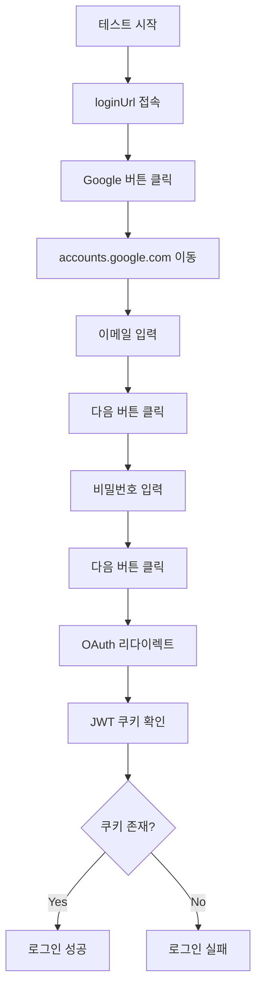

# E2E 테스트 가이드 (스킬테스터)

## 개요
Playwright를 사용한 E2E 테스트 작성 가이드입니다.
Google OAuth 자동 로그인, 크로스 허브 네비게이션, JWT 토큰 전달 등을 포함합니다.

---

## 1. 기본 E2E 테스트 구조

### 1.1 테스트 파일 위치
```
/home/peterchung/HWTestAgent/tests/
├── e2e-[환경]-[프로젝트]-[기능].spec.ts
├── helpers/
│   ├── google-oauth-helper.ts    # Google OAuth 로그인 헬퍼
│   └── ...
```

### 1.2 테스트 파일 명명 규칙
- **환경**: `local`, `oracle-staging`, `oracle-production`
- **프로젝트**: `hubmanager`, `saleshub`, `finhub`, `onboardinghub`
- **기능**: `authenticated`, `navigation`, `crud` 등

예시:
- `e2e-oracle-staging-hubmanager-saleshub.spec.ts`
- `e2e-oracle-staging-authenticated.spec.ts`
- `e2e-local-saleshub-crud.spec.ts`

---

## 2. Google OAuth 자동 로그인

### 2.1 헬퍼 함수 위치
```typescript
import { loginWithGoogle, getTestGoogleCredentials } from './helpers/google-oauth-helper';
```

### 2.2 테스트 계정 정보
- **Email**: `biz.dev@wavebridge.com`
- **Password**: `wave1234!!`
- **환경변수**:
  - `TEST_GOOGLE_EMAIL=biz.dev@wavebridge.com`
  - `TEST_GOOGLE_PASSWORD=wave1234!!`

### 2.3 자동 로그인 사용 예시

```typescript
import { test, expect } from '@playwright/test';
import { loginWithGoogle, getTestGoogleCredentials } from './helpers/google-oauth-helper';

test('Google OAuth 자동 로그인', async ({ page }) => {
  const { email, password } = getTestGoogleCredentials();

  const success = await loginWithGoogle(page, {
    email,
    password,
    loginUrl: 'http://158.180.95.246:4400', // HubManager URL
    redirectPath: '/hubs', // 로그인 후 리다이렉트될 경로
    timeout: 30000
  });

  expect(success).toBe(true);
});
```

### 2.4 자동 로그인 프로세스



### 2.5 헬퍼 함수 설명

#### `loginWithGoogle(page, config)`
Google OAuth 자동 로그인 수행

**파라미터**:
```typescript
interface GoogleOAuthConfig {
  email: string;          // 테스트 계정 이메일
  password: string;       // 테스트 계정 비밀번호
  loginUrl: string;       // 로그인 시작 URL
  redirectPath?: string;  // 로그인 후 리다이렉트될 경로
  timeout?: number;       // 타임아웃 (기본: 30000ms)
}
```

**반환값**: `Promise<boolean>` - 로그인 성공 여부

**사용 예시**:
```typescript
const success = await loginWithGoogle(page, {
  email: 'biz.dev@wavebridge.com',
  password: 'wave1234!!',
  loginUrl: 'http://158.180.95.246:4400',
  redirectPath: '/hubs'
});
```

#### `getTestGoogleCredentials()`
환경변수에서 테스트 계정 정보 가져오기

**반환값**:
```typescript
{
  email: string;    // TEST_GOOGLE_EMAIL 또는 기본값
  password: string; // TEST_GOOGLE_PASSWORD 또는 기본값
}
```

#### `isAuthenticated(page)`
현재 페이지의 인증 상태 확인

**반환값**: `Promise<boolean>` - 인증 여부

**사용 예시**:
```typescript
const authenticated = await isAuthenticated(page);
console.log('인증 상태:', authenticated);
```

#### `getAuthToken(page)`
현재 페이지의 JWT 토큰 가져오기

**반환값**: `Promise<string | null>` - JWT 토큰 또는 null

**사용 예시**:
```typescript
const token = await getAuthToken(page);
console.log('JWT Token:', token);
```

#### `logout(page, logoutUrl)`
로그아웃 수행 및 쿠키 삭제

**사용 예시**:
```typescript
await logout(page, 'http://158.180.95.246:4400/auth/logout');
```

---

## 3. 크로스 허브 네비게이션 테스트

### 3.1 허브 간 이동 테스트

```typescript
test('크로스 허브 네비게이션', async ({ page }) => {
  // 로그인
  const { email, password } = getTestGoogleCredentials();
  await loginWithGoogle(page, {
    email,
    password,
    loginUrl: 'http://158.180.95.246:4400'
  });

  // HubManager → SalesHub → HubManager
  await page.goto('http://158.180.95.246:4400', { waitUntil: 'networkidle' });
  const auth1 = await isAuthenticated(page);
  expect(auth1).toBe(true);

  await page.goto('http://158.180.95.246:4400/saleshub', { waitUntil: 'networkidle' });
  const auth2 = await isAuthenticated(page);
  expect(auth2).toBe(true);

  await page.goto('http://158.180.95.246:4400', { waitUntil: 'networkidle' });
  const auth3 = await isAuthenticated(page);
  expect(auth3).toBe(true);
});
```

### 3.2 JWT 토큰 전달 확인

```typescript
test('JWT 토큰 전달 확인', async ({ page }) => {
  // 로그인
  const { email, password } = getTestGoogleCredentials();
  await loginWithGoogle(page, {
    email,
    password,
    loginUrl: 'http://158.180.95.246:4400'
  });

  // HubManager 쿠키 확인
  await page.goto('http://158.180.95.246:4400');
  const hubManagerCookies = await page.context().cookies();
  console.log('HubManager Cookies:', hubManagerCookies.map(c => c.name));

  // SalesHub 쿠키 확인
  await page.goto('http://158.180.95.246:4400/saleshub');
  const salesHubCookies = await page.context().cookies();
  console.log('SalesHub Cookies:', salesHubCookies.map(c => c.name));

  // JWT 토큰 존재 확인
  const token = await getAuthToken(page);
  expect(token).not.toBeNull();
});
```

---

## 4. 스크린샷 캡처

### 4.1 스크린샷 저장 경로
```
/home/peterchung/HWTestAgent/test-results/MyTester/screenshots/
└── YYYY-MM-DD-[프로젝트명]-[환경]/
    ├── 01-step-name.png
    ├── 02-step-name.png
    └── ...
```

### 4.2 스크린샷 캡처 예시

```typescript
import * as path from 'path';
import * as fs from 'fs';

const SCREENSHOT_DIR = '/home/peterchung/HWTestAgent/test-results/MyTester/screenshots/2026-01-12-Oracle-Staging-E2E';

test.beforeAll(() => {
  if (!fs.existsSync(SCREENSHOT_DIR)) {
    fs.mkdirSync(SCREENSHOT_DIR, { recursive: true });
  }
});

test('스크린샷 캡처', async ({ page }) => {
  await page.goto('http://158.180.95.246:4400');

  // 전체 페이지 스크린샷
  await page.screenshot({
    path: path.join(SCREENSHOT_DIR, '01-hubmanager-home.png'),
    fullPage: true
  });

  // 특정 요소만 스크린샷
  await page.locator('[data-testid="hub-card"]').first().screenshot({
    path: path.join(SCREENSHOT_DIR, '02-hub-card.png')
  });
});
```

---

## 5. 네트워크 모니터링

### 5.1 네트워크 요청/응답 모니터링

```typescript
test('네트워크 모니터링', async ({ page }) => {
  // 네트워크 요청 모니터링
  page.on('request', request => {
    console.log('📡 Request:', request.method(), request.url());
  });

  // 네트워크 응답 모니터링
  page.on('response', response => {
    console.log('📦 Response:', response.status(), response.url());
  });

  // 실패한 요청 모니터링
  page.on('requestfailed', request => {
    console.log('❌ Failed:', request.url(), request.failure()?.errorText);
  });

  // 콘솔 에러 모니터링
  page.on('console', msg => {
    if (msg.type() === 'error') {
      console.log('❌ Console Error:', msg.text());
    }
  });

  await page.goto('http://158.180.95.246:4400');
});
```

### 5.2 정적 파일 로드 확인

```typescript
test('정적 파일 서빙 확인', async ({ page }) => {
  const resourceTypes: { [key: string]: number } = {
    stylesheet: 0,
    script: 0,
    image: 0
  };

  page.on('response', response => {
    const resourceType = response.request().resourceType();
    if (resourceType in resourceTypes) {
      resourceTypes[resourceType]++;
      console.log(`📦 ${resourceType}: ${response.url()} (${response.status()})`);
    }
  });

  await page.goto('http://158.180.95.246:4400/saleshub', { waitUntil: 'networkidle' });

  console.log('📊 Resource Summary:', resourceTypes);

  expect(resourceTypes.stylesheet).toBeGreaterThan(0);
  expect(resourceTypes.script).toBeGreaterThan(0);
});
```

---

## 6. API 헬스체크

### 6.1 기본 헬스체크

```typescript
test('API 헬스체크', async ({ page }) => {
  const apiUrl = 'http://158.180.95.246:4400/saleshub/api/health';
  const response = await page.goto(apiUrl, { timeout: 10000 });

  // 상태 코드 확인
  expect(response?.status()).toBe(200);

  // Content-Type 확인
  const contentType = response?.headers()['content-type'];
  expect(contentType).toContain('application/json');

  // JSON 응답 확인
  const body = await response?.json();
  expect(body).toHaveProperty('success');
  expect(body.success).toBe(true);
});
```

### 6.2 인증된 API 호출

```typescript
test('인증된 API 호출', async ({ page }) => {
  // 로그인
  const { email, password } = getTestGoogleCredentials();
  await loginWithGoogle(page, {
    email,
    password,
    loginUrl: 'http://158.180.95.246:4400'
  });

  // 인증이 필요한 API 호출
  const apiUrl = 'http://158.180.95.246:4400/saleshub/api/customers';
  const response = await page.goto(apiUrl);

  // 200 (성공) 또는 401 (비인증)
  expect([200, 401]).toContain(response?.status());
});
```

---

## 7. 환경별 설정

### 7.1 환경 URL 설정

```typescript
// 환경별 URL
const ENVIRONMENTS = {
  local: {
    hubManager: 'http://localhost:4090',
    salesHub: 'http://localhost:4010',
    finHub: 'http://localhost:4020'
  },
  staging: {
    hubManager: 'http://158.180.95.246:4400',
    salesHub: 'http://158.180.95.246:4400/saleshub',
    finHub: 'http://158.180.95.246:4400/finhub'
  },
  production: {
    hubManager: 'http://workhub.biz',
    salesHub: 'http://workhub.biz/saleshub',
    finHub: 'http://workhub.biz/finhub'
  }
};

// 환경 선택
const ENV = process.env.TEST_ENV || 'staging';
const URLS = ENVIRONMENTS[ENV];
```

### 7.2 환경변수 설정

```bash
# .env 파일
TEST_ENV=staging
TEST_GOOGLE_EMAIL=biz.dev@wavebridge.com
TEST_GOOGLE_PASSWORD=wave1234!!
```

---

## 8. 테스트 실행

### 8.1 전체 테스트 실행

```bash
cd /home/peterchung/HWTestAgent
npx playwright test
```

### 8.2 특정 테스트 파일 실행

```bash
npx playwright test tests/e2e-oracle-staging-authenticated.spec.ts
```

### 8.3 UI 모드로 실행 (디버깅)

```bash
npx playwright test tests/e2e-oracle-staging-authenticated.spec.ts --ui
```

### 8.4 특정 테스트만 실행

```bash
npx playwright test -g "Google OAuth 자동 로그인"
```

### 8.5 헤드풀 모드로 실행 (브라우저 표시)

```bash
npx playwright test --headed
```

---

## 9. 테스트 리포트 생성

### 9.1 리포트 파일 위치
```
/home/peterchung/HWTestAgent/test-results/MyTester/reports/
└── YYYY-MM-DD-[프로젝트명]-E2E-테스트.md
```

### 9.2 리포트 구조

```markdown
# E2E 테스트 리포트

## 요약
- 총 테스트: N개
- 통과: N개
- 실패: N개
- 실행 시간: N초

## 테스트 결과 상세
### 1. 테스트 이름
- 목적: ...
- 결과: ✅ 통과 / ❌ 실패
- 스크린샷: ...

## 발견된 이슈
...

## 개선 사항
...
```

---

## 10. 베스트 프랙티스

### 10.1 테스트 독립성
- 각 테스트는 독립적으로 실행 가능해야 함
- 테스트 간 의존성 금지
- `test.beforeEach`에서 초기화

### 10.2 명확한 테스트 이름
```typescript
// Good
test('Google OAuth 자동 로그인 후 HubManager 접속', async ({ page }) => {
  // ...
});

// Bad
test('test1', async ({ page }) => {
  // ...
});
```

### 10.3 적절한 대기 시간
```typescript
// Good - 명시적 대기
await page.waitForSelector('[data-testid="hub-card"]', { timeout: 5000 });

// Bad - 하드코딩된 대기
await page.waitForTimeout(5000);
```

### 10.4 에러 처리
```typescript
try {
  await page.goto(url, { timeout: 10000 });
} catch (error) {
  console.error('페이지 로드 실패:', error);
  // 스크린샷 캡처
  await page.screenshot({ path: 'error.png' });
  throw error;
}
```

### 10.5 스크린샷 활용
- 각 주요 단계에서 스크린샷 캡처
- 에러 발생 시 자동 스크린샷
- 전체 페이지 스크린샷 (`fullPage: true`)

---

## 11. 트러블슈팅

### 11.1 로그인 실패
**문제**: Google OAuth 로그인 실패

**해결**:
1. 테스트 계정 비밀번호 확인
2. Google 로그인 페이지 선택자 확인
3. 타임아웃 시간 증가 (30000 → 60000)
4. 헤드풀 모드로 실행하여 확인

### 11.2 JWT 토큰 미전달
**문제**: 허브 간 이동 시 JWT 토큰 전달 안됨

**해결**:
1. 쿠키 도메인 확인 (`.workhub.biz`)
2. HttpOnly, Secure 속성 확인
3. SameSite 속성 확인 (`Lax` 또는 `None`)

### 11.3 SPA 로딩 타이밍 이슈
**문제**: "로딩 중..." 화면만 캡처됨

**해결**:
```typescript
await page.waitForLoadState('networkidle');
await page.waitForSelector('[data-testid="main-content"]', { timeout: 5000 });
await page.waitForTimeout(1000); // 추가 대기
```

### 11.4 선택자 미탐지
**문제**: 버튼/링크를 찾을 수 없음

**해결**:
```typescript
// 여러 선택자 시도
const selectors = [
  'button:has-text("Sales Hub")',
  '[data-testid="saleshub-card"]',
  'a[href="/saleshub"]'
];

for (const selector of selectors) {
  const element = page.locator(selector).first();
  if (await element.count() > 0) {
    await element.click();
    break;
  }
}
```

---

## 12. 참고 문서

- Playwright 공식 문서: https://playwright.dev
- WorkHub 컨텍스트: `/home/peterchung/WHCommon/claude-context.md`
- 테스트 리포트 예시: `/home/peterchung/HWTestAgent/test-results/MyTester/reports/`
- Google OAuth 헬퍼: `/home/peterchung/HWTestAgent/tests/helpers/google-oauth-helper.ts`

---

## 13. 체크리스트

E2E 테스트 작성 시 다음 사항을 확인하세요:

- [ ] 테스트 계정 정보 환경변수 설정
- [ ] 로그인 필요 시 `loginWithGoogle` 헬퍼 사용
- [ ] 각 주요 단계에서 스크린샷 캡처
- [ ] 네트워크 요청/응답 모니터링 (필요시)
- [ ] API 헬스체크 포함
- [ ] JWT 토큰 전달 확인 (크로스 허브)
- [ ] 적절한 타임아웃 설정 (30초 권장)
- [ ] 에러 처리 및 로깅
- [ ] 테스트 리포트 생성
- [ ] 스크린샷 경로 확인

---

**작성자**: Claude Sonnet 4.5
**작성일**: 2026-01-12
**버전**: 1.0
