# BC카드-웨이브릿지 스테이블코인 시스템 구체화

---

## Executive Summary — 경영진 요약

### ES.1 사업 배경 및 목적

글로벌 결제 시장에서 스테이블코인은 기존 카드 결제 인프라를 보완하는 차세대 결제 수단으로 부상하고 있습니다. Visa, Mastercard 등 글로벌 카드 네트워크가 USDC 기반 정산을 도입하고 있으며, 국내에서도 디지털자산기본법 입법을 앞두고 스테이블코인의 "지급이전" 기능에 대한 제도적 기반이 마련되고 있습니다.

본 사업은 **BC카드의 결제 인프라 및 지갑 기술**과 **웨이브릿지(이하 WB)의 가상자산사업자(VASP) 인프라**를 결합하여, BC페이북 1,100만 회원 대상 스테이블코인 결제 서비스를 구축하는 것을 목표로 합니다.

| 구분 | BC카드 | 웨이브릿지 |
|------|--------|-----------|
| 전략적 의의 | 차세대 결제 인프라 확보, 디지털 자산 결제 시장 선점 | VASP 인프라를 활용한 규제 준수 기반 제공 |
| 핵심 자산 | 페이북 1,100만 회원, 전국 가맹점 네트워크, 지갑 기술 | VASP 라이선스, 커스터디, 온오프램프, 컴플라이언스 |
| 역할 | 고객 접점, 가맹점 인프라, **비수탁 지갑 구축·운영** | 수탁 보관, 원화 전환, AML/트래블룰 |

### ES.2 서비스 구조 한눈에 보기

본 서비스의 핵심 구조는 다음과 같습니다.

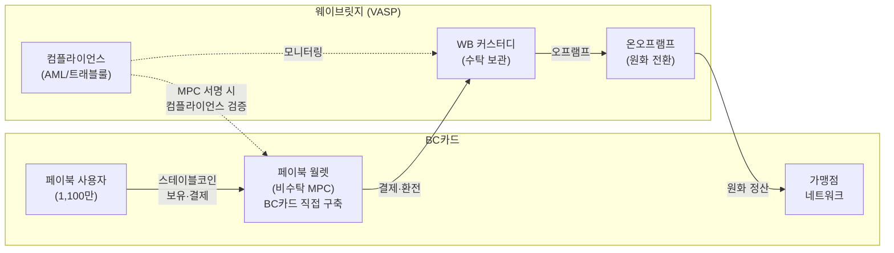

**양사 역할 분담**

- **BC카드**: 페이북 앱 UI/UX, **비수탁 지갑(페이북 월렛) 직접 구축·운영**, 사용자 인증, 가맹점 네트워크, 정산 인프라
- **웨이브릿지**: 수탁형 커스터디 서비스, 원화-스테이블코인 전환(온오프램프), 전 구간 컴플라이언스(AML, 트래블룰) 검증

**자산 소유권·보관 구조**

| 구성요소 | 소유권 | 구축·운영 주체 | 핵심 포인트 |
|---------|--------|--------------|------------|
| 페이북 월렛 (비수탁) | 사용자 본인 | **BC카드 직접 구축** | 사용자가 키를 보유, BC카드가 지갑 인프라 운영 |
| WB 커스터디 (수탁) | BC카드 명의 | WB가 VASP로서 위탁 보관 | BC카드 소유이나 직접 보관하지 않음 |
| 결제 정산 흐름 | — | WB 경유 | BC카드가 가상자산을 실보유하지 않는 구조 |

**핵심 기술 요소**

- **페이북 월렛 (BC카드 구축)**: MPC 2-of-3 비수탁 지갑으로, 사용자·BC카드·WB 3자가 키 샤드를 분산 보유합니다. 어떤 단일 주체도 독립적으로 자산을 이동할 수 없으며, BC카드가 직접 지갑 인프라를 구축·운영합니다.
- **WB 커스터디**: BC카드 명의 자산을 WB가 보관·관리하는 수탁 서비스로, 콜드/핫 월렛 분리, HSM 기반 보안 아키텍처를 적용합니다.
- **온오프램프**: 원화와 스테이블코인 간 전환을 WB가 수행하며, 네팅(상계) 구조를 통해 실제 전환량을 최소화합니다.

### ES.3 규제 적합성 요약

본 서비스 구조는 현행 규제 체계와의 정합성을 다음과 같이 확보합니다.

- **금가분리 원칙 충족**: BC카드는 지갑 UI 및 인프라를 제공할 뿐, 가상자산을 직접 보유·취급하지 않습니다. 모든 가상자산의 보관·전환은 VASP인 WB를 통해 수행됩니다.
- **비수탁 지갑 분류 근거**: MPC 2-of-3 구조에서 사용자가 키 샤드를 직접 보유하며, 사용자의 서명 없이는 자산 이동이 불가합니다. 다만 WB가 컴플라이언스 목적으로 서명 거부권을 보유하므로, 규제당국의 해석에 따른 수탁 판정 가능성이 잔여 리스크로 존재합니다.
- **트래블룰·AML 대응**: 모든 외부 전송에 대해 WB의 MPC 서명 전 컴플라이언스 게이트가 작동합니다. 미승인 시 트랜잭션 자체가 성립하지 않는 구조입니다.

현재 내부 법률 검토(WB-2026-LEGAL-001, 2026. 02. 06. 발송)가 진행 중이며, 5대 핵심 쟁점에 대한 회신을 2026. 02. 20.까지 수령할 예정입니다.

### ES.4 사업 모델 및 시장 기회

**사업 구조의 경제성**

본 사업은 스테이블코인의 전환·보관·전송 과정에서 발생하는 수수료를 수익 기반으로 합니다. BC카드의 기존 결제 인프라를 활용하므로 추가 가맹점 확보 비용이 최소화되며, 네팅(상계) 구조를 통해 운영 비용을 효율적으로 관리할 수 있습니다.

| 수수료 항목 | 과금 기준 | 발생 시점 |
|------------|----------|----------|
| 오프램프 전환 수수료 | 전환 금액 기반 | 스테이블코인 → 원화 전환 시 |
| 온램프 전환 수수료 | 전환 금액 기반 | 원화 → 스테이블코인 전환 시 |
| 건별 전송 수수료 | 건당 정액 또는 정률 | WB 커스터디 → 페이북 월렛 전송 시 |
| 수탁 수수료 | 수탁 잔액 기반 연율 | 커스터디 자산 보관 |

**시장 기회**: BC카드의 연간 카드결제 처리 규모는 약 219조원입니다. 스테이블코인 결제가 이 중 극히 일부(0.1%)만 전환하더라도 약 2,190억원 규모의 거래량이 발생합니다. 기존 가맹점 네트워크와 페이북 사용자 기반을 그대로 활용할 수 있으므로, 신규 인프라 투자 대비 높은 사업 효율성이 기대됩니다.

**운영 효율성**: 네팅(상계) 구조를 통해 온램프(고객 충전)와 오프램프(가맹점 정산)를 일일 단위로 상계 처리함으로써, 실제 원화-스테이블코인 전환량을 최소화하고 전체 운영 비용을 절감합니다.

### ES.5 추진 일정 요약

| Phase | 시기 | 주요 내용 |
|-------|------|----------|
| **1. 구조 확정** | 2026 Q2 | 본 문서 기반 구조 합의, NDA 체결, 법률 검토 반영 |
| **2. PoC** | 2026 Q3 | 소규모 가맹점 대상 결제 실증, MPC 지갑·커스터디·온오프램프 통합 테스트 |
| **3. 상용화** | 2026 Q4 | BC페이북 내 월렛 정식 출시, 가맹점 확대 |
| **4. 확장** | 2027~ | AI 에이전트 기반 결제 확장, 원화 스테이블코인 대응, APAC 확장 |

현재 Phase 1 단계로서, 양사 간 기술 구조 확정 및 규제 적합성 검토가 진행 중입니다.

---

## 1. 사업 개요

### 1.1 사업 목표

본 사업은 BC카드와 웨이브릿지가 공동으로 **스테이블코인 기반 결제 서비스**를 구축하는 것을 목표로 합니다.

글로벌 스테이블코인 시장은 결제·송금 분야에서 빠르게 확장되고 있으며, 국내에서도 디지털자산기본법 제정을 계기로 스테이블코인의 "지급이전" 기능이 법적 기반을 갖추게 됩니다. 이러한 시장 환경에서 양사의 핵심 역량을 결합하면 국내 최초의 대규모 스테이블코인 결제 서비스를 선점할 수 있습니다.

**BC카드의 사업 목표**

- 차세대 결제 인프라 확보를 통한 중장기 경쟁력 강화
- 디지털 자산에 친숙한 MZ세대 고객 유입 및 페이북 플랫폼 활성화
- 자체 비수탁 지갑 기술 역량 확보

**웨이브릿지의 역할**

- VASP 라이선스 기반 규제 준수 인프라 제공
- 수탁 보관, 원화 전환, 컴플라이언스 서비스를 통한 안정적인 백엔드 운영

### 1.2 단기 과제 (2026 Q3~Q4)

| 과제 | 내용 | 담당 |
|------|------|------|
| 페이북 월렛 구축 | MPC 기반 비수탁 지갑의 BC페이북 앱 내 구현 | **BC카드** |
| WB 커스터디 연동 | BC카드 명의 수탁 지갑 생성 및 자산 보관 연동 | WB |
| 온오프램프 연동 | 원화-스테이블코인 전환 및 네팅 프로세스 검증 | WB |
| 가맹점 결제 실증 | 소규모 가맹점 그룹 대상 QR 결제 테스트 | BC카드(가맹점) + WB(정산) |

### 1.3 장기 과제 (2027~)

- **AI 에이전트 결제 확장**: AI 에이전트가 사용자를 대신하여 스테이블코인 결제를 자율적으로 수행하는 서비스로 확장합니다.
- **원화 스테이블코인 대응**: 디지털자산기본법 시행 후 원화 스테이블코인이 발행될 경우, 이를 결제 수단으로 통합합니다.
- **APAC 글로벌 확장**: 동남아 시장을 중심으로 크로스보더 스테이블코인 결제 서비스를 확장합니다.

---

## 2. BC카드의 서비스 방향 및 협력사업 내 역할

### 2.1 BC카드의 포지셔닝

BC카드는 여신전문금융업법(여전법)에 의거한 허가 카드사로서, 국내 결제 인프라의 핵심 참여자입니다. 페이북 앱을 통해 약 1,100만 명의 B2C 사용자 기반을 확보하고 있으며, 전국 가맹점 네트워크를 운영하고 있습니다.

현행 금융규제 체계에서는 금융회사와 가상자산 취급 간의 분리(이하 "금가분리 원칙")가 적용되고 있습니다. 이에 따라 본 사업에서 BC카드는 **고객 접점·가맹점 인프라·비수탁 지갑 기술을 담당**하되, 가상자산의 수탁 보관·원화 전환은 수행하지 않는 구조로 참여합니다. 수탁 보관 및 원화 전환은 VASP인 웨이브릿지가 담당합니다.

### 2.2 BC카드가 제공하는 서비스

**비수탁 지갑: 페이북 월렛 (BC카드 직접 구축)**

BC카드는 MPC 기반 비수탁형 디지털 지갑인 "페이북 월렛"을 직접 구축·운영합니다. 사용자는 기존 페이북 앱에서 스테이블코인 충전, 잔액 조회, 결제, 전송, 환전 기능을 이용할 수 있습니다. BC카드는 지갑 인프라 운영 및 키 샤드 #2(고객 인증·정책) 관리를 담당하며, WB는 컴플라이언스 검증을 위한 키 샤드 #3만 보유합니다.

**B2C 고객 접점**

페이북 앱 내에 월렛 서비스를 탑재하여, 기존 1,100만 사용자에게 스테이블코인 결제 기능을 제공합니다.

**가맹점 네트워크**

기존 BC카드 가맹점을 스테이블코인 결제 수용 인프라로 확장합니다. 가맹점은 별도의 블록체인 기술 역량 없이도 기존 BC카드 정산 체계를 통해 원화로 정산받을 수 있습니다.

**정산 연동**

가맹점이 수취한 스테이블코인은 WB 커스터디에서 원화로 전환(오프램프)된 후, BC카드의 기존 정산망을 통해 가맹점에 원화로 지급됩니다.

### 2.3 웨이브릿지와의 역할 분담 개요

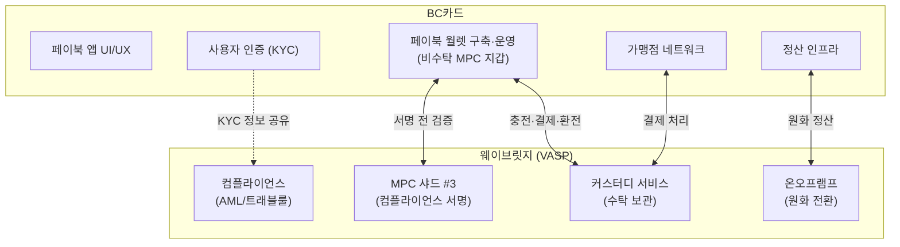

> **[다이어그램 #1]** 양사 역할 분담 구조도

| 영역 | BC카드 | 웨이브릿지 |
|------|--------|-----------|
| 고객 접점 | 페이북 앱 UI/UX, 고객 서비스 | — |
| 비수탁 지갑 | **페이북 월렛 직접 구축·운영**, 키 샤드 #2 보유 | 컴플라이언스 검증용 키 샤드 #3 보유 |
| 사용자 인증 | 기존 KYC 체계 활용 | KYC 정보 수령 (위탁 검증) |
| 자산 보관 | — | 커스터디 서비스 (수탁) |
| 원화 전환 | — | 온오프램프 수행 |
| 가맹점 정산 | 정산망 운영, 원화 지급 | 스테이블코인 → 원화 전환 |
| 컴플라이언스 | — | AML, 트래블룰, 이상거래 탐지 |

### 2.4 자산 소유권·보관 구조 요약

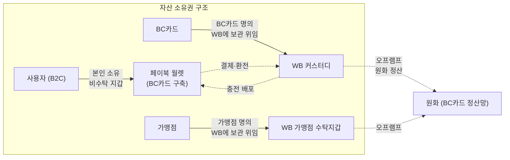

> **[다이어그램 #2]** 자산 소유권 흐름도

본 구조에서 BC카드는 수탁 자산의 **법적 소유자**(커스터디 계정 명의)이나, 실제 보관·관리는 WB에 위탁합니다. 비수탁 지갑(페이북 월렛)은 BC카드가 직접 구축하되, 자산의 소유권은 사용자에게 있습니다. 이를 통해 BC카드가 가상자산을 직접 보유(실보유)하지 않는 구조를 유지합니다.

---

## 3. 비수탁형 지갑: 페이북 월렛

### 3.1 서비스 개요

| 항목 | 내용 |
|------|------|
| 서비스명 | 페이북 월렛 |
| 대상 | BC페이북 B2C 사용자 (약 1,100만 명) |
| 형태 | BC페이북 앱 내 임베디드 지갑 |
| 지갑 유형 | MPC 기반 비수탁형 (non-custodial) |
| **구축·운영** | **BC카드 직접 구축** |
| 주요 기능 | 스테이블코인 보유, 충전, 결제, 외부 전송, 환전/출금 |
| 지원 자산 | USDT, USDC (추후 원화 스테이블코인 추가) |

페이북 월렛은 BC카드가 직접 구축하는 MPC 기반 비수탁형 디지털 지갑입니다. 사용자는 스테이블코인을 직접 보유하고, 이를 가맹점 결제·외부 전송·환전 등에 활용할 수 있습니다. WB는 지갑의 구축·운영에 관여하지 않으며, 트랜잭션 서명 시 컴플라이언스 검증(AML, 트래블룰)을 위한 키 샤드 #3만 보유합니다.

### 3.2 MPC 기반 비수탁 구조

#### 3.2.1 MPC(Multi-Party Computation) 지갑 개요

MPC(다자간 연산)란, 하나의 개인키를 여러 조각(키 샤드)으로 분산하여 복수의 주체가 보유하고, 트랜잭션 서명 시 각 주체가 자신의 샤드를 이용해 **부분 서명을 독립적으로 수행**한 후, 이를 결합하여 최종 서명을 완성하는 암호학적 기술입니다.

본 서비스에서는 **2-of-3 임계 서명(Threshold Signature) 구조**를 적용합니다. 3개의 키 샤드 중 2개 이상이 서명에 참여해야 트랜잭션이 성립하며, 어떤 단일 주체도 독자적으로 자산을 이동할 수 없습니다.

| 구분 | 단일 개인키 | MPC 2-of-3 |
|------|-----------|-----------|
| 키 분실 리스크 | 분실 시 자산 영구 손실 | 1개 샤드 분실 시 나머지 2개로 복구 가능 |
| 단일 장애점 | 존재 (키 탈취 시 전액 유출) | 없음 (2개 이상 동시 탈취 필요) |
| 규제 대응 | — | 서명 전 컴플라이언스 검증 가능 |

#### 3.2.2 키 샤드 분배 구조

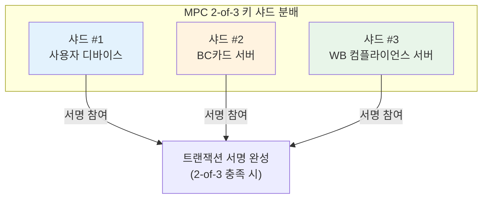

> **[다이어그램 #3]** MPC 키 샤드 분배 구조

| 키 샤드 | 보유 주체 | 역할 | 단독 자산 이동 |
|---------|----------|------|--------------|
| 샤드 #1 | 사용자 디바이스 | 트랜잭션 발의, 사용 의사 표현 | **불가** |
| 샤드 #2 | **BC카드 서버** | 고객 인증 확인, 서비스 정책 적용 | **불가** |
| 샤드 #3 | WB 컴플라이언스 서버 | AML/트래블룰 검증, 컴플라이언스 승인 | **불가** |

트랜잭션이 성립하기 위해서는 3개 샤드 중 2개 이상의 서명이 필요합니다. 일반적인 결제·전송 시나리오에서는 3자 모두가 서명에 참여하며, 다음과 같은 검증 구조가 작동합니다.

1. **사용자**: 결제·전송 의사를 표현하고 샤드 #1로 서명
2. **BC카드**: 사용자 본인 인증을 확인하고 서비스 정책(한도, 빈도 등)을 검증한 후 샤드 #2로 서명
3. **WB**: 컴플라이언스 검증(제재 리스트, 이상거래, 트래블룰)을 수행한 후 샤드 #3으로 서명

#### 3.2.3 비수탁 분류 근거

본 구조가 비수탁(non-custodial)으로 분류되는 근거는 다음과 같습니다.

1. **사용자 키 보유**: 사용자가 키 샤드 #1을 직접 보유하며, 사용자의 서명 없이는 어떤 트랜잭션도 성립하지 않습니다.
2. **BC카드·WB의 독립적 접근 불가**: BC카드(샤드 #2)와 WB(샤드 #3)가 합의하더라도, 사용자(샤드 #1) 없이는 자산 이동이 불가합니다.
3. **사용자 의사 우선**: 모든 트랜잭션은 사용자의 발의(샤드 #1 서명)로부터 시작되며, BC카드와 WB는 이를 검증하는 역할에 한정됩니다.

국제 기준으로는 FATF의 Updated Guidance(2021)에서 "사용자가 독립적으로 트랜잭션을 발의할 수 있고, 서비스 제공자가 사용자 동의 없이 자산을 이동할 수 없는 경우" 비수탁으로 분류하고 있습니다. 국내 특금법에서는 비수탁 지갑에 대한 명시적 정의가 부재하나, FATF 가이드라인과의 정합성을 기준으로 판단할 수 있습니다.

#### 3.2.4 비수탁 분류 리스크

비수탁 분류에는 다음과 같은 규제적 리스크가 존재합니다.

**WB의 서명 거부권 문제**: WB는 컴플라이언스 목적으로 샤드 #3의 서명을 거부할 수 있습니다. 이는 AML/CFT 의무 이행에 필수적이나, 규제당국이 이를 "서비스 제공자의 자산 통제권"으로 해석할 경우 수탁으로 판정될 가능성이 있습니다.

**수탁 판정 시 영향**: 수탁으로 판정될 경우, 페이북 월렛의 모든 사용자에 대해 WB가 개별적으로 VASP 고객 온보딩(KYC/CDD)을 수행해야 합니다. 이는 운영 비용 및 사용자 경험에 상당한 영향을 미칩니다.

**대응 방향**: 서비스 출시 전 FIU(금융정보분석원) 사전 상담을 통해 비수탁 분류의 유효성을 확인하며, 수탁 판정 시를 대비한 대체 구조도 병행 검토합니다. 상세 분석은 섹션 6에서 다룹니다.

### 3.3 페이북 월렛 기능 상세

#### 3.3.1 스테이블코인 보유 및 잔액 조회

사용자는 페이북 월렛에서 다음 스테이블코인을 보유할 수 있습니다.

| 자산 | 발행사 | 네트워크 | 비고 |
|------|--------|---------|------|
| USDT | Tether | Ethereum / Tron | 글로벌 최대 시가총액 스테이블코인 |
| USDC | Circle | Ethereum / Solana | 규제 친화적, 준비금 투명성 |
| 원화 스테이블코인 | TBD | TBD | 디지털자산기본법 시행 후 추가 |

잔액은 보유 스테이블코인의 수량과 함께, 실시간 환율 기반의 **원화 환산 금액**이 병행 표시됩니다.

#### 3.3.2 충전 (온램프)

사용자가 원화를 스테이블코인으로 전환하여 페이북 월렛에 적재하는 과정입니다.

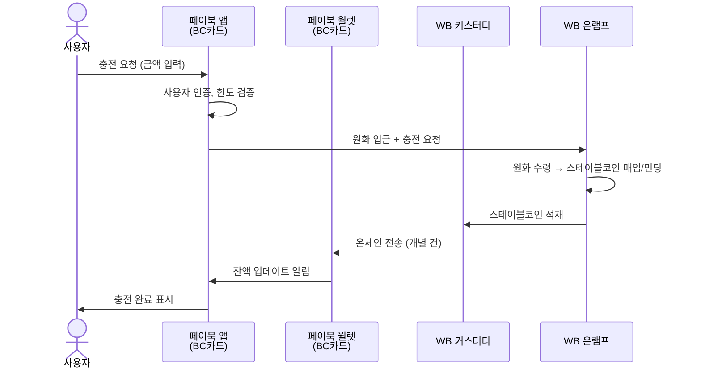

> **[다이어그램 #4]** 충전(온램프) 플로우

충전 과정에서 원화는 BC카드의 결제 체계를 통해 수집되며, WB가 이를 수령하여 스테이블코인으로 전환합니다. 전환된 스테이블코인은 WB 커스터디에 일시 보관된 후, 개별 온체인 트랜잭션을 통해 사용자의 페이북 월렛으로 전송됩니다.

#### 3.3.3 결제 (가맹점)

사용자가 페이북 월렛의 스테이블코인으로 가맹점에서 결제하는 과정입니다.

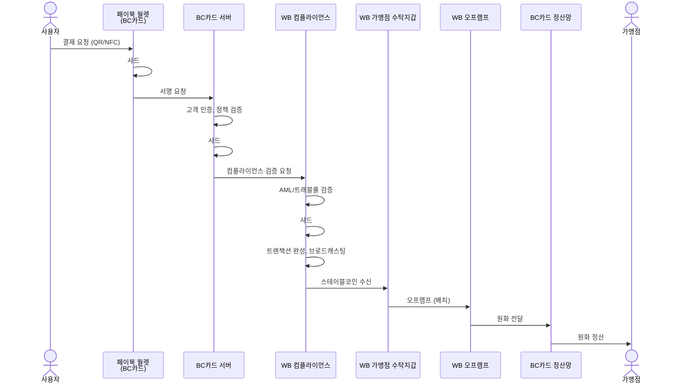

> **[다이어그램 #5]** 결제 플로우

결제 시 사용자의 스테이블코인은 가맹점의 WB 수탁지갑으로 이동하며, 이후 배치 단위로 원화 전환(오프램프) 후 BC카드 정산망을 통해 가맹점에 원화로 정산됩니다.

#### 3.3.4 외부 전송 (양방향)

페이북 월렛은 외부 지갑과의 양방향 전송을 지원합니다.

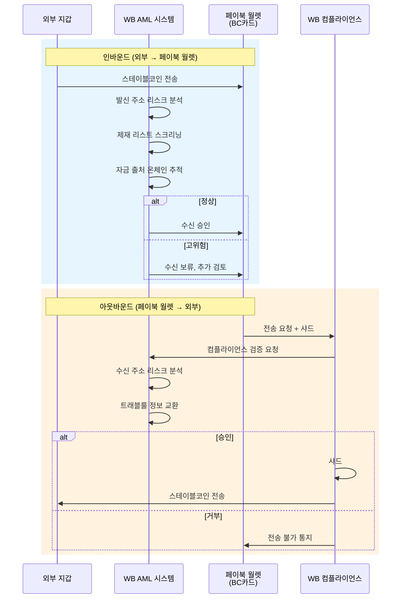

> **[다이어그램 #6]** 외부 전송 플로우

외부 전송은 모든 건에 대해 온체인 AML 분석이 적용됩니다(상세 내용은 섹션 5 참조). 특히 아웃바운드 전송의 경우, WB의 MPC 서명 전 컴플라이언스 게이트가 작동하여, 미승인 시 트랜잭션 자체가 성립하지 않는 실질적 차단 구조를 갖추고 있습니다.

#### 3.3.5 환전/출금 (오프램프)

사용자가 보유 스테이블코인을 원화로 전환하여 본인 계좌로 출금하는 과정입니다.

1. 사용자가 페이북 앱에서 환전/출금 요청
2. 페이북 월렛에서 WB 커스터디로 스테이블코인 전송 (내부 전송)
3. WB 오프램프에서 스테이블코인 → 원화 전환
4. 사용자 지정 은행 계좌로 원화 출금

내부 전송(페이북 월렛 → WB 커스터디)은 양측 모두 통제된 환경 하에 있으므로, 별도의 외부 AML 검증 없이 처리됩니다.

### 3.4 트랜잭션 서명 프로세스

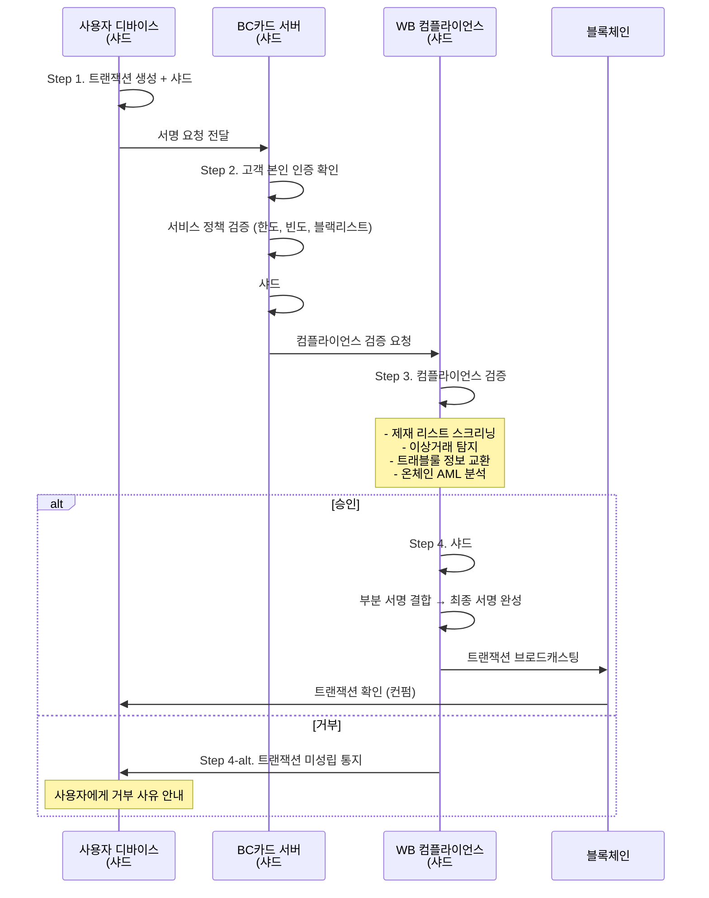

> **[다이어그램 #7]** MPC 트랜잭션 서명 프로세스

본 프로세스의 핵심은 **Step 3의 컴플라이언스 게이트**입니다. WB 컴플라이언스 서버가 모든 트랜잭션에 대해 AML/CFT 검증을 수행하고, 미승인 시 샤드 #3 서명을 거부함으로써 트랜잭션 자체를 차단합니다. 이는 비수탁 지갑에서도 VASP 수준의 컴플라이언스를 실현하는 구조적 장치입니다.

### 3.5 가맹점 지갑: 비수탁형 vs 수탁형 비교

가맹점이 스테이블코인 결제 대금을 수취하기 위한 지갑 구조에는 두 가지 옵션이 있습니다.

#### 3.5.1 옵션 A — 가맹점 비수탁형 (페이북 월렛 가맹점 버전)

가맹점도 사용자와 동일한 MPC 2-of-3 비수탁 지갑을 보유하는 구조입니다.

**장점**: 가맹점이 스테이블코인을 자율적으로 관리할 수 있으며, 수탁 위탁이 불필요합니다.

**한계**:

- **원화 정산 문제**: 가맹점이 스테이블코인을 원화로 전환하려면 직접 오프램프를 수행해야 합니다. 이를 위해서는 각 가맹점이 VASP에 개별 온보딩해야 하며, 소규모 가맹점의 경우 현실적으로 어렵습니다.
- **수신 VASP 부재**: 사용자(비수탁) → 가맹점(비수탁) 전송 시, 수신측에 VASP가 존재하지 않아 트래블룰 이행이 구조적으로 불가능합니다.
- **가맹점 KYB 주체 불명확**: 비수탁 구조에서 가맹점에 대한 KYB(기업 고객확인)를 누가 수행하는지 불분명합니다.
- **정산 자동화 어려움**: 가맹점마다 별도의 오프램프 프로세스를 거쳐야 하므로, BC카드 정산망과의 자동 연동이 사실상 불가합니다.

#### 3.5.2 옵션 B — 가맹점 수탁형 (WB 커스터디)

가맹점이 WB에 온보딩(KYB)하여, WB 수탁지갑으로 결제 대금을 수취하는 구조입니다.

**장점**:

- **수신 VASP 확보**: WB가 수신 VASP로서 트래블룰 의무를 이행할 수 있습니다.
- **자동 원화 정산**: WB 커스터디에 수신된 스테이블코인을 자동으로 원화 전환(오프램프)하여 BC카드 정산망에 전달합니다. 가맹점은 기존과 동일하게 원화로 정산받습니다.
- **가맹점 운영 부담 최소화**: 가맹점은 별도의 블록체인 기술 역량이 불필요합니다.

**한계**: 가맹점이 WB에 KYB(기업 고객확인) 절차를 거쳐 온보딩해야 합니다. 다만, 이는 일회성 절차이며 BC카드 가맹점 등록 프로세스와 병행 처리가 가능합니다.

#### 3.5.3 비교 분석 및 결론

| 평가 항목 | 옵션 A: 비수탁형 | 옵션 B: 수탁형 |
|----------|----------------|---------------|
| 원화 정산 자동화 | 불가 (가맹점 직접 오프램프) | **가능** (자동 정산) |
| 트래블룰 준수 | 구조적 불가 (수신 VASP 부재) | **가능** (WB가 수신 VASP) |
| 가맹점 운영 부담 | 높음 (개별 VASP 온보딩 필요) | **낮음** (일회성 KYB) |
| AML/CFT 이행 | 사각지대 발생 | **전 구간 수행** |
| 규제 명확성 | 낮음 (비수탁 간 전송 규제 모호) | **높음** (수탁 VASP 구조 명확) |
| BC카드 정산 연동 | 개별 대응 필요 | **기존 정산망 활용** |

**결론**: 가맹점 지갑은 **수탁형(옵션 B)**을 권장합니다. 트래블룰 준수, 원화 정산 자동화, 가맹점 운영 부담 최소화 등 모든 평가 항목에서 수탁형이 우위에 있으며, 대규모 가맹점 확장에 적합한 구조입니다.

### 3.6 기술적 고려사항

| 항목 | 목표 | 고려사항 |
|------|------|---------|
| MPC 서명 레이턴시 | 3초 이내 | 3자 간 네트워크 통신, 컴플라이언스 검증 시간 포함 |
| 키 복구 | 24시간 이내 | 사용자 디바이스 분실 시, BC카드 본인 인증 + 키 재생성 |
| 앱 임베딩 | 네이티브 수준 UX | BC페이북 앱 내 네이티브 모듈 또는 SDK 연동 |
| 블록체인 네트워크 | 확정 필요 | Ethereum(높은 보안) vs Tron/Solana(낮은 비용, 높은 처리량) |

---

## 4. 웨이브릿지 프라임: 커스터디 및 온오프램프

### 4.1 서비스 개요

| 항목 | 내용 |
|------|------|
| 서비스명 | 웨이브릿지 프라임 (WB Prime) |
| 대상 | BC카드 (B2B 서비스) |
| 서비스 유형 | 수탁 커스터디 + 온오프램프 + 지갑 전송 + 가맹점 정산 + 컴플라이언스 |
| 법적 기반 | 특금법상 VASP 신고 기반 가상자산 보관·관리 서비스 |

웨이브릿지 프라임은 BC카드에 제공하는 B2B 서비스 패키지로서, 다음 핵심 서비스를 포함합니다.

1. **커스터디 서비스**: BC카드 명의 가상자산의 보관·관리
2. **온오프램프 서비스**: 원화 ↔ 스테이블코인 전환
3. **지갑 전송 서비스**: WB 커스터디 ↔ 페이북 월렛 간 온체인 전송
4. **가맹점 정산 서비스**: 가맹점 수탁지갑 운영 및 원화 정산
5. **컴플라이언스 서비스**: MPC 샤드 #3 기반 AML/트래블룰 검증

> 페이북 월렛(비수탁 지갑)은 BC카드가 직접 구축·운영하며, WB 프라임의 서비스 범위에 포함되지 않습니다.

### 4.2 BC카드 명의 커스터디 서비스

#### 4.2.1 수탁 구조

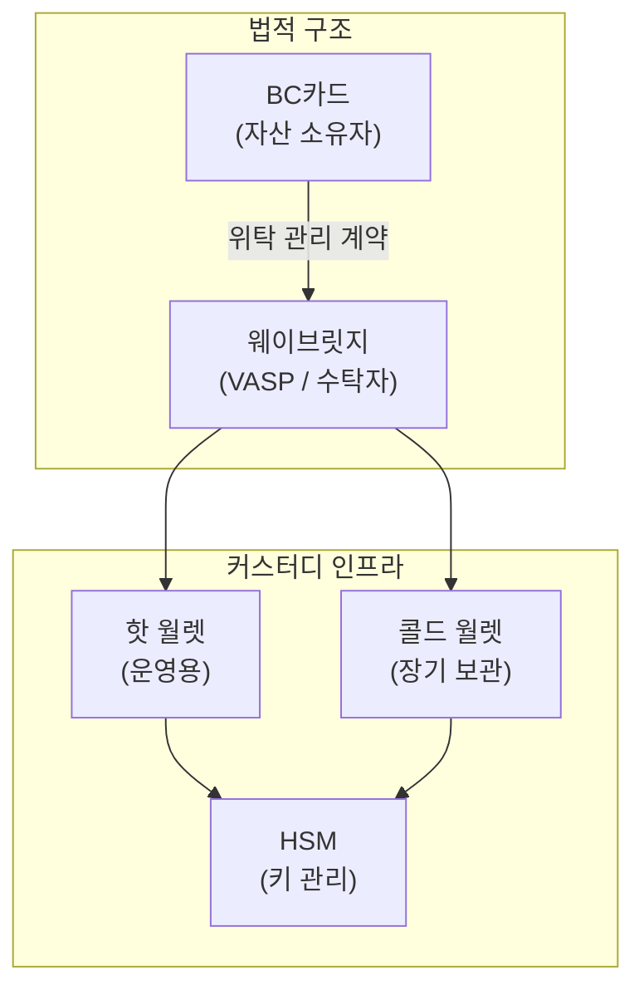

> **[다이어그램 #8]** WB 커스터디 수탁 구조

| 항목 | 내용 |
|------|------|
| 자산 소유권 | BC카드 (법적 명의) |
| 보관·관리 책임 | WB (VASP로서 수탁) |
| 법적 구조 | 위탁 관리 계약 (수임자: WB) |
| 핵심 원칙 | BC카드는 가상자산을 "실보유"하지 않음 |

BC카드는 커스터디 계정의 법적 명의자이나, 가상자산의 물리적 보관 및 트랜잭션 실행은 WB가 수행합니다. 이 구조를 통해 BC카드는 금가분리 원칙을 충족하면서도 서비스 운영에 필요한 자산을 확보할 수 있습니다.

#### 4.2.2 커스터디 대상 자산

- **현재**: USDT, USDC
- **향후**: 디지털자산기본법 시행 후 원화 스테이블코인 추가 대응
- 커스터디에 보관되는 자산은 사용자 충전(온램프)을 위한 재고, 가맹점 결제 대금(정산 전), 운영 예비 자산 등으로 구성됩니다.

#### 4.2.3 보안 아키텍처

| 보안 요소 | 적용 내용 |
|----------|----------|
| 콜드/핫 월렛 분리 | 전체 자산의 대부분을 오프라인 콜드 월렛에 보관, 운영에 필요한 최소 금액만 핫 월렛에 배치 |
| HSM 적용 | Hardware Security Module을 통한 개인키 보호 (FIPS 140-2 Level 3 이상) |
| 다중 서명 | 커스터디 자산 출금 시 복수 승인자의 다중 서명 필요 |
| 보험 | 해킹·내부 부정 등에 대한 가상자산 보관 보험 가입 (보장 범위 별도 협의) |

#### 4.2.4 수탁 수수료 구조

수탁 수수료는 **수탁 잔액 기반 연율 과금** 방식으로 부과됩니다. 일일 평균 수탁 잔액을 기준으로 연율을 적용하며, 월 단위로 정산합니다. 구체적인 요율은 양사 간 별도 협의를 통해 확정합니다.

### 4.3 온오프램프 서비스

#### 4.3.1 온램프 (원화 → 스테이블코인)

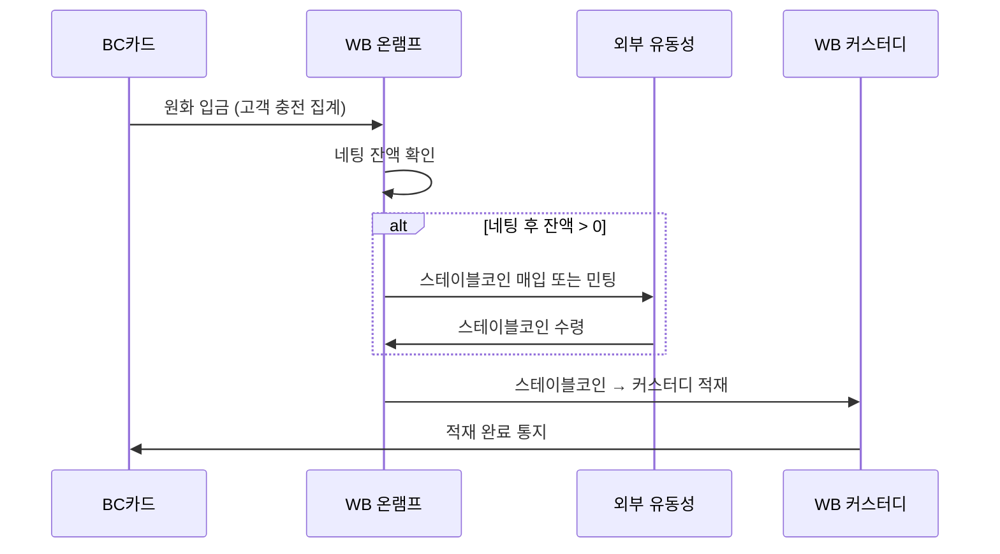

> **[다이어그램 #9]** 온램프 플로우 (WB 프라임)

온램프 과정에서 BC카드가 지급한 원화는 WB를 통해 스테이블코인으로 전환됩니다. WB는 직접 민팅(USDC의 경우 Circle을 통한 발행) 또는 OTC/거래소 매입을 통해 스테이블코인을 확보하며, 이를 WB 커스터디에 적재합니다.

#### 4.3.2 오프램프 (스테이블코인 → 원화)

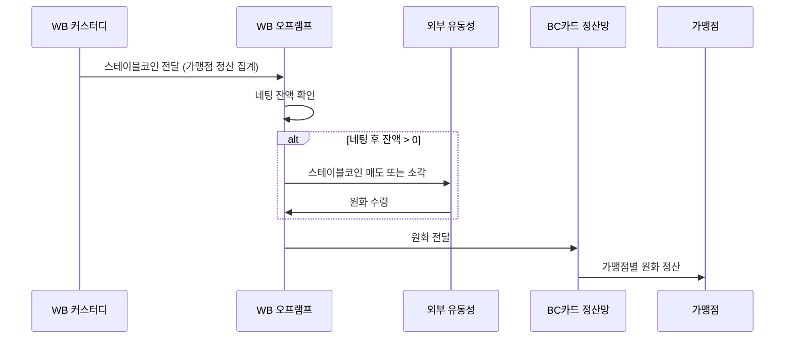

> **[다이어그램 #10]** 오프램프 플로우 (WB 프라임)

오프램프는 주로 가맹점 결제 대금의 원화 전환에서 발생합니다. WB 커스터디에 집계된 가맹점 결제 대금을 배치 단위로 원화 전환하여 BC카드 정산망에 전달하며, BC카드가 가맹점별로 원화를 정산합니다.

#### 4.3.3 네팅(상계) 구조

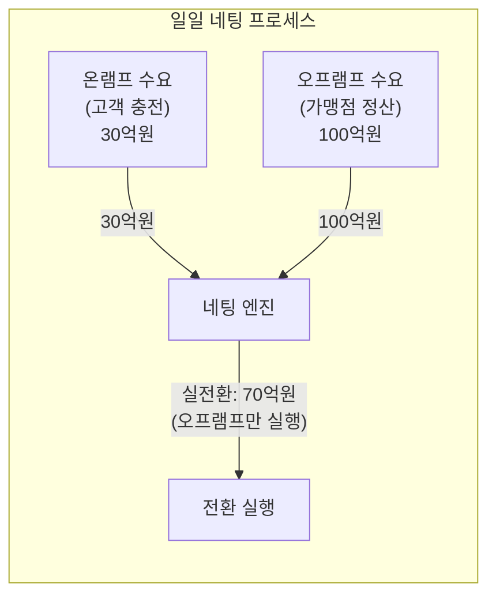

> **[다이어그램 #11]** 네팅(상계) 구조

네팅은 일정 기간(기본: 일일) 동안 발생한 온램프 수요와 오프램프 수요를 상계하여, **차액분만 실제 전환**하는 구조입니다. 이를 통해 전환 비용 및 거래 수수료를 절감하고, 전체 서비스의 운영 효율성을 높입니다.

**네팅 예시**:

| 구분 | 금액 | 설명 |
|------|------|------|
| 오프램프 수요 | 100억원 | 가맹점 결제 대금 원화 정산 |
| 온램프 수요 | 30억원 | 고객 충전 요청 |
| **네팅 후 실전환** | **70억원** | 오프램프만 실행 |
| 절감 효과 | 30억원 | 온램프 전환 불필요 (기존 스테이블코인 재활용) |

**네팅 대상과 비대상**:

- 네팅 **대상**: 온/오프램프 전환 (원화 ↔ 스테이블코인 교환)
- 네팅 **비대상**: 온체인 전송 (WB 커스터디 → 페이북 월렛). 전송은 충전 요청 건별로 실제 온체인 트랜잭션이 필요하므로 상계할 수 없습니다.

#### 4.3.4 전환 수수료 구조

| 수수료 항목 | 과금 기준 | 비대칭 여부 |
|------------|----------|-----------|
| 오프램프 전환 수수료 | 전환 금액 대비 정률 | 온램프와 상이할 수 있음 |
| 온램프 전환 수수료 | 전환 금액 대비 정률 | 오프램프와 상이할 수 있음 |

온/오프램프 수수료는 비대칭 설정이 가능합니다. 예를 들어, USDC의 경우 Circle을 통한 민팅(온램프)은 수수료가 없거나 매우 낮으나, 소각(오프램프) 시 상이한 비용 구조가 적용될 수 있습니다. 구체적인 요율은 양사 간 별도 협의를 통해 확정합니다.

### 4.4 고객 지갑 전송 서비스

#### 4.4.1 WB 커스터디 → 페이북 월렛 (충전 배포)

사용자가 충전을 요청하면, WB 커스터디에서 개별 사용자의 페이북 월렛(BC카드 운영)으로 스테이블코인을 온체인 전송합니다. 이 구간은 **인플로우(Inflow)**에 해당하며, 서비스 전체에서 운영 공수가 가장 높은 구간입니다.

| 전송 옵션 | 장점 | 단점 | 적합 시나리오 |
|----------|------|------|-------------|
| 실시간 전송 | 사용자 경험 우수 | 가스비 높음, 피크 시 병목 | 소액 즉시 충전 |
| 배치 전송 | 가스비 최적화 가능 | 충전 지연 (최대 수 시간) | 대량 정기 충전 |

각 전송 건에 대해 **건별 전송 수수료**가 부과되며, 이는 온체인 가스비 및 운영 비용을 포함합니다.

#### 4.4.2 페이북 월렛 → WB 커스터디 (결제/환전 수취)

사용자가 가맹점 결제 또는 환전/출금을 수행하면, 페이북 월렛에서 WB 커스터디(또는 가맹점 수탁지갑)로 스테이블코인이 전송됩니다. 이 구간은 **아웃플로우(Outflow)**에 해당합니다.

아웃플로우는 통제된 환경 내의 전송이므로, 외부 AML 이슈가 최소화됩니다. 또한, 가맹점 결제 대금은 배치 집계 후 일괄 오프램프 처리가 가능하여 운영이 단순합니다.

#### 4.4.3 인플로우/아웃플로우 비대칭 분석

| 구분 | 아웃플로우 (결제/환전) | 인플로우 (충전 배포) |
|------|---------------------|-------------------|
| 방향 | 페이북 월렛 → WB 커스터디 | WB 커스터디 → 페이북 월렛 |
| 처리 방식 | 배치 집계 → 일괄 전환 | 건별 온체인 전송 |
| 수신 지갑 수 | 소수 (WB 커스터디 + 가맹점 수탁지갑) | 다수 (개별 사용자 지갑) |
| 가스비 | 상대적 낮음 | **상대적 높음** |
| 운영 공수 | 단순 | **복잡** |

인플로우(충전 배포)는 **대량의 개별 사용자 지갑에 각각 온체인 트랜잭션을 발생**시켜야 하므로, 가스비·처리 시간·트랜잭션 모니터링 측면에서 운영 공수가 큽니다. 이러한 비대칭성이 수수료 구조에 반영됩니다.

### 4.5 가맹점 정산 서비스

#### 4.5.1 가맹점 WB 수탁지갑 운영

가맹점은 스테이블코인 결제 대금을 수취하기 위해 WB에 온보딩(KYB)합니다. 온보딩 완료 시 WB는 가맹점 명의의 수탁지갑을 생성하며, 해당 지갑으로 결제 대금이 자동 수신됩니다.

- **온보딩 절차**: 가맹점 사업자 정보 확인(KYB), 이용약관 동의, 수탁지갑 생성
- **BC카드 가맹점 등록과의 연계**: BC카드 가맹점 등록 프로세스에 KYB를 포함하여 일원화 처리 가능

#### 4.5.2 가맹점 원화 정산 프로세스

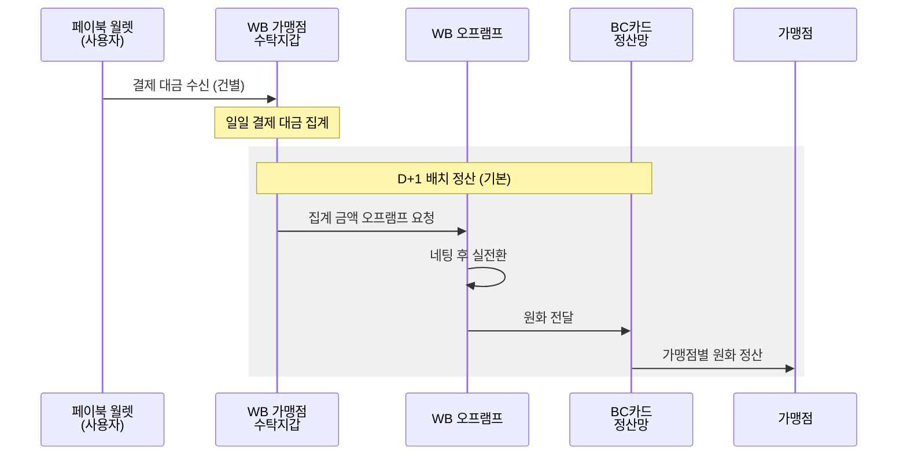

> **[다이어그램 #12]** 가맹점 원화 정산 프로세스

| 정산 옵션 | 주기 | 적합 대상 |
|----------|------|----------|
| D+1 배치 정산 (기본) | 전일 결제 대금을 익일 일괄 정산 | 대부분의 가맹점 |
| 즉시 정산 (옵션) | 결제 건별 또는 시간별 실시간 정산 | 대형 가맹점, 고빈도 거래 가맹점 |

가맹점 입장에서는 기존 카드 결제와 동일한 원화 정산을 받게 되므로, 스테이블코인 결제 수용에 따른 추가 운영 부담이 사실상 없습니다.

#### 4.5.3 가맹점 스테이블코인 직접 보유 옵션

일부 가맹점이 원화 전환 없이 스테이블코인을 직접 보유하고자 하는 경우, 다음 옵션을 제공합니다.

- **WB 수탁지갑 내 보유**: 오프램프를 수행하지 않고 수탁지갑에 스테이블코인을 보유
- **외부 전송**: 가맹점이 지정한 외부 지갑으로 스테이블코인을 전송 (온체인 AML 적용)

### 4.6 기술적 고려사항

| 항목 | 목표/대응 | 상세 |
|------|----------|------|
| 가스비 최적화 | 배치 처리, 네트워크 선정 | 대량 전송 시 가스비 절감을 위한 배치 그룹핑, L2 네트워크 활용 검토 |
| 네트워크 혼잡 대응 | 큐잉 + 재시도 | 블록체인 혼잡 시 트랜잭션 큐잉, 가스비 자동 조정, 실패 시 재시도 |
| SLA | 가용성 99.9% | 커스터디 서비스 가용성, 온오프램프 처리 시간 SLA 명시 |
| 장애 대응 | 큐잉 + 수동 처리 | 블록체인 네트워크 장애 시 트랜잭션 큐잉, 복구 후 순차 처리 |

---

## 5. 페이북 월렛 입출금의 온체인 AML 시스템

### 5.1 AML 적용 구간 분류

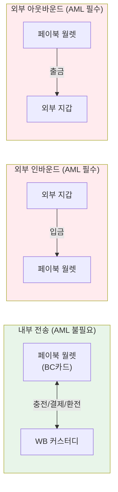

> **[다이어그램 #13]** AML 적용 구간 분류

| 구간 | 발신 | 수신 | AML 적용 | 근거 |
|------|------|------|---------|------|
| 내부 | 페이북 월렛 | WB 커스터디 | 불필요 | 양측 모두 통제된 환경, 사용자 신원 확인 완료 |
| 내부 | WB 커스터디 | 페이북 월렛 | 불필요 | 양측 모두 통제된 환경 |
| 외부 인바운드 | 외부 지갑 | 페이북 월렛 | **필수** | 자금 출처 불명, 발신자 신원 미확인 |
| 외부 아웃바운드 | 페이북 월렛 | 외부 지갑 | **필수** | 자금 도착지 리스크, 트래블룰 적용 대상 |

### 5.2 인바운드 AML (외부 → 페이북 월렛)

외부 지갑에서 페이북 월렛으로 스테이블코인이 수신되는 경우, 다음의 AML 검증이 적용됩니다.

1. **발신 주소 리스크 스코어링**: 온체인 분석 도구를 통해 발신 주소의 과거 거래 이력, 연관 주소 클러스터, 리스크 레벨을 평가합니다.
2. **제재 리스트 스크리닝**: OFAC(미국 재무부 해외자산통제실), UN, EU 등 국제 제재 리스트와 발신 주소를 대조합니다.
3. **자금 출처 온체인 추적 (Hop Analysis)**: 발신 주소로부터 역방향으로 N-hop 추적하여, 자금의 원천이 고위험 출처(다크넷 마켓, 믹싱 서비스, 랜섬웨어 등)에 해당하는지 분석합니다.
4. **판정 및 조치**:
   - **정상**: 수신 승인, 페이북 월렛 잔액에 반영
   - **고위험**: 수신 보류, 컴플라이언스 팀 수동 검토 후 승인/반환 결정

### 5.3 아웃바운드 AML (페이북 월렛 → 외부)

페이북 월렛에서 외부 지갑으로 스테이블코인을 전송하는 경우, **MPC 서명 전 컴플라이언스 게이트**를 통해 다음 검증을 수행합니다.

1. **수신 주소 리스크 분석**: 수신 주소의 리스크 스코어를 평가합니다.
2. **트래블룰 적용**:
   - 수신 주소가 VASP에 소속된 경우: 수신 VASP를 식별하고 트래블룰 프로토콜(CATUR 등)을 통해 송수신인 정보를 교환합니다.
   - 수신 주소가 개인지갑(비VASP)인 경우: 수신자 본인 확인 등 추가 검증을 수행합니다.
3. **이상거래 탐지**: 소액 다건(structuring), 비정상적 전송 패턴, 일일 한도 초과 등을 탐지합니다.
4. **MPC 컴플라이언스 게이트**: 상기 검증을 모두 통과한 경우에만 WB가 샤드 #3으로 서명하여 트랜잭션을 완성합니다. **미승인 시 트랜잭션 자체가 성립하지 않습니다.**

이 구조는 BC카드가 구축한 비수탁 지갑에서도 VASP 수준의 자금세탁방지 의무를 이행할 수 있도록 하는 핵심 메커니즘입니다.

### 5.4 모니터링 인프라

| 인프라 요소 | 내용 |
|------------|------|
| 온체인 분석 도구 | Chainalysis KYT / Bonanza 등을 통한 실시간 트랜잭션 모니터링 |
| STR 자동 생성 | 의심거래 탐지 시 의심거래보고서(STR) 자동 생성, FIU 보고 |
| Structuring 탐지 | 소액 다건 전송을 통한 임계값 회피 행위 패턴 탐지 |
| 리포팅 | BC카드에 AML 모니터링 결과 정기 리포트 제공 |

### 5.5 AML 서비스 범위 정의

| 서비스 항목 | 서비스 레벨 | 리포팅 |
|------------|-----------|--------|
| 트랜잭션 모니터링 | 실시간 (모든 외부 전송 건) | 일일 요약 리포트 |
| 제재 리스트 스크리닝 | 실시간 (모든 외부 전송 건) | 매칭 건 즉시 통보 |
| 이상거래 탐지 | 실시간 + 배치(패턴 분석) | 주간 분석 리포트 |
| STR 보고 | 탐지 후 24시간 이내 FIU 보고 | 월간 STR 현황 |
| 트래블룰 정보 교환 | 아웃바운드 전송 건별 실시간 | 월간 이행 현황 |

---

## 6. 규제적 쟁점

### 6.1 비수탁 지갑 분류 기준

MPC 2-of-3 구조에서의 비수탁 분류는 다음 기준에서 검토가 필요합니다.

| 기준 | 비수탁 근거 | 수탁 판정 리스크 |
|------|-----------|----------------|
| FATF Updated Guidance (2021) | 사용자가 키 샤드 보유, 사용자 동의 없이 자산 이동 불가 | WB의 서명 거부권이 "통제권"으로 해석될 가능성 |
| 특금법 | 비수탁 지갑에 대한 명시적 정의 부재 | 해석의 여지 존재 |
| 디지털자산기본법 (입법 예정) | 비수탁 서비스에 대한 규제 체계 신설 가능 | 법 시행 전 불확실성 |

WB가 컴플라이언스 목적으로 서명 거부권을 보유하는 것은 AML/CFT 의무 이행에 필수적이나, 이를 규제당국이 "자산에 대한 실질적 통제권"으로 판단할 가능성을 배제할 수 없습니다. **FIU 사전 상담을 통한 유권해석 확보**가 권장됩니다.

### 6.2 사용자 KYC 구조

| 쟁점 | 현황 | 대응 방향 |
|------|------|----------|
| 제3자 KYC 의존 | BC카드 기존 KYC를 WB가 수용 가능한지 | FATF Rec. 17 정합성 검토 중 |
| 개인정보 제3자 제공 | BC카드 → WB 사용자 정보 제공 시 동의 필요 | 개인정보보호법 제17조 기반 동의 절차 설계 |
| WB 약관 동의 | 사용자가 WB 이용약관에 동의해야 하는지 | BC페이북 앱 내 동의 흐름 설계 |

BC카드는 이미 여전법에 의거한 고객 확인(KYC) 절차를 운영하고 있습니다. WB가 BC카드의 KYC 결과를 수용(제3자 KYC 의존)할 수 있다면, 사용자의 이중 온보딩을 방지하여 서비스 이용 편의성을 크게 높일 수 있습니다.

### 6.3 BC카드의 서비스 범위와 금가분리

여전법에 의거한 카드사인 BC카드가 비수탁 지갑을 구축·운영하고 스테이블코인 결제 UI를 제공하는 행위에 대해서는 다음과 같은 규제적 해석이 필요합니다.

- **현행 체계**: BC카드는 지갑 인프라를 구축하되, 가상자산의 수탁 보관·원화 전환은 수행하지 않습니다. 비수탁 지갑의 경우 사용자가 자산의 소유권과 통제권을 직접 보유하므로, BC카드가 가상자산을 취급하는 것으로 보기 어렵습니다.
- **디지털자산기본법 시행 후**: 동 법에서 스테이블코인의 "지급이전" 기능을 VASP 업권 내로 정의할 경우, 비수탁 지갑 구축자의 법적 지위에 대한 세부 규정 확인이 필요합니다.

### 6.4 트래블룰 적용 구조

비수탁 지갑(페이북 월렛)에서 외부 수탁지갑으로 전송 시, "발신 VASP"의 존재 여부가 쟁점입니다.

- **문제**: 페이북 월렛은 BC카드가 구축한 비수탁 지갑이므로, 형식상 발신 측에 VASP가 존재하지 않습니다.
- **대응 구조**: WB가 MPC 서명 과정에서 발신측 정보를 보유하고 있으므로, 실질적으로 트래블룰 정보 교환의 역할을 수행합니다. WB의 컴플라이언스 게이트에서 수신 VASP 식별 및 정보 교환을 사전 수행한 후 서명을 완성하는 방식으로, 트래블룰 의무를 이행합니다.

### 6.5 내부 법률 검토 현황

웨이브릿지는 2026. 02. 06. 자로 내부 법률팀 및 정보보안팀에 5대 핵심 쟁점에 대한 검토를 요청하였습니다 (WB-2026-LEGAL-001).

| 쟁점 번호 | 검토 항목 | 상태 |
|----------|----------|------|
| 1 | 트래블룰 이행을 위한 이용자 신원정보 수집 범위 | 검토 중 |
| 2 | 카드사 KYC에 대한 제3자 의존(reliance) 가능 여부 | 검토 중 |
| 3 | 개인정보 제3자 제공 동의 구조 (개인정보보호법 제17조) | 검토 중 |
| 4 | WB 이용약관 동의 방식 (BC페이북 앱 내 동의 흐름) | 검토 중 |
| 5 | MPC 2-of-3 구조의 비수탁 분류 기준 | 검토 중 |

회신 예정일은 2026. 02. 20.이며, 검토 결과는 본 문서의 차기 버전에 반영할 예정입니다.

---

## 7. 협업 로드맵

### 7.1 Phase 1: 구조 확정 및 NDA (2026 Q2)

- 본 문서를 기반으로 양사 간 기술·사업 구조 합의
- NDA(비밀유지계약) 체결 후 DDQ(Due Diligence Questionnaire) 상호 공유
- 내부 법률 검토 결과(WB-2026-LEGAL-001) 반영
- FIU 사전 상담 일정 수립

### 7.2 Phase 2: PoC (2026 Q3)

- 소규모 가맹점 그룹(10~20개소) 대상 결제 실증
- BC카드 페이북 월렛 구축 및 MPC 서명 프로세스 검증
- WB 커스터디 연동 및 온오프램프 통합 테스트
- AML/트래블룰 시스템 통합 테스트

### 7.3 Phase 3: 서비스 상용화 (2026 Q4)

- BC페이북 앱 내 페이북 월렛 정식 출시
- 가맹점 네트워크 단계적 확대
- 운영 모니터링 체계 가동

### 7.4 Phase 4: AI 에이전트 확장 (2027~)

- AI 에이전트 기반 자율 결제 서비스 확장
- 원화 스테이블코인 출시 시 결제 수단 통합
- APAC 시장 크로스보더 결제 확장 검토

### 7.5 수수료 구조 개요

| 수수료 항목 | 과금 기준 | 비고 |
|------------|----------|------|
| 오프램프 전환 수수료 | 전환 금액 대비 정률 | 가맹점 정산, 사용자 환전 시 |
| 온램프 전환 수수료 | 전환 금액 대비 정률 | 사용자 충전 시 |
| 건별 전송 수수료 | 건당 정액 또는 정률 | WB 커스터디 → 페이북 월렛 전송 시 |
| 수탁 수수료 | 수탁 잔액 기반 연율 | 커스터디 자산 보관 |

구체적인 요율 및 과금 조건은 양사 간 별도 협의를 통해 확정하며, Phase 1 종료 시점까지 합의를 목표로 합니다.

---

## 부록

### A. 용어 정의

| 용어 | 정의 |
|------|------|
| MPC (Multi-Party Computation) | 다자간 연산. 개인키를 복수의 키 샤드로 분산하여 보관하고, 부분 서명을 결합하여 트랜잭션을 완성하는 암호학적 기술 |
| 비수탁 (Non-custodial) | 서비스 제공자가 사용자 자산에 대한 독립적 통제권을 보유하지 않는 지갑 구조 |
| 수탁 (Custodial) | 서비스 제공자가 사용자를 대신하여 자산을 보관·관리하는 구조 |
| VASP (Virtual Asset Service Provider) | 가상자산사업자. 특금법에 따라 FIU에 신고한 가상자산 취급 사업자 |
| 트래블룰 (Travel Rule) | 가상자산 이전 시 송수신인 정보를 함께 전달해야 하는 AML 규정 |
| 온램프 (On-ramp) | 법정화폐(원화)를 가상자산(스테이블코인)으로 전환하는 과정 |
| 오프램프 (Off-ramp) | 가상자산(스테이블코인)을 법정화폐(원화)로 전환하는 과정 |
| 네팅 (Netting) | 일정 기간 동안의 매수(온램프)와 매도(오프램프) 수요를 상계하여 차액분만 실제 전환하는 구조 |
| HSM (Hardware Security Module) | 암호키를 안전하게 보관·관리하는 전용 하드웨어 장치 |
| KYC (Know Your Customer) | 고객 확인 의무. 고객의 신원을 확인하는 절차 |
| KYB (Know Your Business) | 기업 고객 확인. 법인 고객(가맹점)의 사업자 정보를 확인하는 절차 |
| STR (Suspicious Transaction Report) | 의심거래보고. 자금세탁이 의심되는 거래를 FIU에 보고하는 제도 |
| FIU (Financial Intelligence Unit) | 금융정보분석원. 자금세탁방지 및 테러자금조달 방지를 담당하는 기관 |

### B. 참조 법률 및 규제

| 법률/규제 | 약칭 | 관련 내용 |
|----------|------|----------|
| 특정 금융거래정보의 보고 및 이용 등에 관한 법률 | 특금법 | VASP 신고, AML 의무, 트래블룰 |
| 여신전문금융업법 | 여전법 | BC카드의 카드업 규제 근거 |
| 전자금융거래법 | 전금법 | 전자결제 서비스 규제 |
| 개인정보 보호법 | 개인정보보호법 | 제17조: 제3자 제공 동의 |
| 디지털자산기본법 | 디자법 (입법 예정) | 스테이블코인 지급이전 기능, VASP 업권 재정의 |
| FATF Recommendations | — | Rec. 15 (가상자산), Rec. 17 (제3자 의존) |
| FATF Updated Guidance (2021) | — | 비수탁 지갑 분류 기준, VASP 정의 |

### C. 다이어그램 목록

| 번호 | 제목 | 위치 |
|------|------|------|
| #1 | 양사 역할 분담 구조도 | 섹션 2.3 |
| #2 | 자산 소유권 흐름도 | 섹션 2.4 |
| #3 | MPC 키 샤드 분배 구조 | 섹션 3.2.2 |
| #4 | 충전(온램프) 플로우 | 섹션 3.3.2 |
| #5 | 결제 플로우 | 섹션 3.3.3 |
| #6 | 외부 전송 플로우 | 섹션 3.3.4 |
| #7 | MPC 트랜잭션 서명 프로세스 | 섹션 3.4 |
| #8 | WB 커스터디 수탁 구조 | 섹션 4.2.1 |
| #9 | 온램프 플로우 (WB 프라임) | 섹션 4.3.1 |
| #10 | 오프램프 플로우 (WB 프라임) | 섹션 4.3.2 |
| #11 | 네팅(상계) 구조 | 섹션 4.3.3 |
| #12 | 가맹점 원화 정산 프로세스 | 섹션 4.5.2 |
| #13 | AML 적용 구간 분류 | 섹션 5.1 |

---

> **문서 이력**
>
> | 버전 | 일자 | 작성자 | 변경 내용 |
> |------|------|--------|----------|
> | v0.1 | 2026. 02. 10. | 웨이브릿지 사업개발팀 | 초안 작성 |
> | v0.2 | 2026. 02. 10. | 웨이브릿지 사업개발팀 | 페이북 월렛 BC카드 직접 구축으로 역할 재정의, 사업 관점 재구성 |
