# BC카드-웨이브릿지 스테이블코인 시스템 구체화

---

## Executive Summary — 경영진 요약

### ES.1 사업 배경 및 목적

글로벌 결제 시장에서 스테이블코인은 기존 카드 결제 인프라를 보완하는 차세대 결제 수단으로 부상하고 있습니다. Visa, Mastercard 등 글로벌 카드 네트워크가 USDC 기반 정산을 도입하고 있으며, 국내에서도 디지털자산기본법 입법을 앞두고 스테이블코인의 "지급이전" 기능에 대한 제도적 기반이 마련되고 있습니다.

본 사업은 **BC카드의 결제 인프라 및 지갑 기술**과 **웨이브릿지(이하 WB)의 가상자산사업자(VASP) 인프라**를 결합하여, BC페이북 1,100만 회원 대상 스테이블코인 결제 서비스를 구축하는 것을 목표로 합니다.

| 구분 | BC카드 | 웨이브릿지 |
|------|--------|-----------|
| 전략적 의의 | 차세대 결제 인프라 확보, 디지털 자산 결제 시장 선점 | VASP 인프라를 활용한 규제 준수 기반 제공 |
| 핵심 자산 | 페이북 1,100만 회원, 전국 가맹점 네트워크, 지갑 기술 | VASP 라이선스, 커스터디, 온오프램프, 컴플라이언스 |
| 역할 | 고객 접점, 가맹점 인프라, **비수탁 지갑 구축·운영** | 수탁 보관, 원화 전환, AML/트래블룰 |

### ES.2 서비스 구조 한눈에 보기

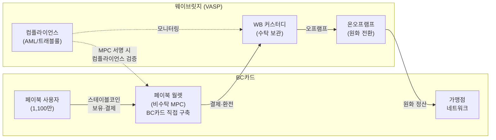

**양사 역할 분담**

- **BC카드**: 페이북 앱 UI/UX, **비수탁 지갑(페이북 월렛) 직접 구축·운영**, 사용자 인증, 가맹점 네트워크, 정산 인프라
- **웨이브릿지**: 수탁형 커스터디 서비스, 원화-스테이블코인 전환(온오프램프), 전 구간 컴플라이언스(AML, 트래블룰) 검증

**자산 소유권·보관 구조**

| 구성요소 | 소유권 | 구축·운영 주체 | 핵심 포인트 |
|---------|--------|--------------|------------|
| 페이북 월렛 (비수탁) | 사용자 본인 | **BC카드 직접 구축** | 사용자가 키를 보유, BC카드가 지갑 인프라 운영 |
| WB 커스터디 (수탁) | BC카드 명의 | WB가 VASP로서 위탁 보관 | BC카드 소유이나 직접 보관하지 않음 |
| 결제 정산 흐름 | — | WB 경유 | BC카드가 가상자산을 실보유하지 않는 구조 |

### ES.3 규제 적합성 요약

- **금가분리 원칙 충족**: BC카드는 지갑 UI 및 인프라를 제공할 뿐, 가상자산을 직접 보유·취급하지 않습니다. 모든 가상자산의 보관·전환은 VASP인 WB를 통해 수행됩니다.
- **비수탁 지갑 분류 근거**: MPC 2-of-3 구조에서 사용자가 키 샤드를 직접 보유하며, 사용자의 서명 없이는 자산 이동이 불가합니다. 다만 WB가 컴플라이언스 목적으로 서명 거부권을 보유하므로, 규제당국의 해석에 따른 수탁 판정 가능성이 잔여 리스크로 존재합니다.
- **트래블룰·AML 대응**: 모든 외부 전송에 대해 WB의 MPC 서명 전 컴플라이언스 게이트가 작동합니다. 미승인 시 트랜잭션 자체가 성립하지 않는 구조입니다.

### ES.4 사업 모델 및 시장 기회

본 사업은 스테이블코인의 전환·보관·전송 과정에서 발생하는 수수료를 수익 기반으로 합니다. BC카드의 기존 결제 인프라를 활용하므로 추가 가맹점 확보 비용이 최소화되며, 상계 구조를 통해 운영 비용을 효율적으로 관리할 수 있습니다.

| 수수료 항목 | 과금 기준 | 예상 요율 (가안) | 발생 시점 |
|------------|----------|----------------|----------|
| 오프램프 전환 수수료 | 전환 금액 기반 | 0.3~0.8% | 스테이블코인 → 원화 전환 시 |
| 온램프 전환 수수료 | 전환 금액 기반 | 0.2~0.5% | 원화 → 스테이블코인 전환 시 |
| 건별 전송 수수료 | 건당 정액 또는 정률 | 500~2,000원/건 | WB 커스터디 → 페이북 월렛 전송 시 |
| 수탁 수수료 | 수탁 잔액 기반 연율 | 0.1~0.3%/년 | 커스터디 자산 보관 |

> 상기 요율은 구조 검토를 위한 가안이며, 양사 간 별도 협의를 통해 확정합니다.

**시장 기회**: BC카드의 연간 카드결제 처리 규모는 약 219조원입니다. 글로벌 카드 네트워크(Visa, Mastercard)의 스테이블코인 정산 도입, Stripe·PayPal의 스테이블코인 결제 지원 등 업계 추세를 고려할 때, 국내 카드결제 시장에서도 스테이블코인 전환이 진행될 것으로 예상됩니다. 초기 전환율 0.1% 가정 시에도 약 2,190억원 규모의 거래량이 발생하며, 기존 가맹점 네트워크를 그대로 활용할 수 있어 신규 인프라 투자 대비 높은 사업 효율성이 기대됩니다.

**상계 구조의 운영 효율**: 온/오프램프 수요를 상계하여 차액분만 실전환함으로써 실제 전환 비용을 절감합니다. 서비스 초기에는 충전(온램프) 수요가 결제 정산(오프램프) 수요를 상회할 수 있으나, 가맹점 네트워크 확대에 따라 양방향 거래량이 균형을 이루면서 상계 효율이 점진적으로 개선됩니다.

### ES.5 추진 일정 요약

| Phase | 시기 | 주요 내용 |
|-------|------|----------|
| **1. 구조 확정** | 2026 Q2 | 본 문서 기반 구조 합의, NDA 체결 |
| **2. PoC** | 2026 Q3 | 소규모 가맹점 대상 결제 실증, MPC 지갑·커스터디·온오프램프 통합 테스트 |
| **3. 상용화** | 2026 Q4 | BC페이북 내 월렛 정식 출시, 가맹점 확대 |
| **4. 확장** | 2027~ | AI 에이전트 기반 결제 확장, 원화 스테이블코인 대응, APAC 확장 |

현재 Phase 1 단계로서, 양사 간 기술 구조 확정 및 규제 적합성 검토가 진행 중입니다.

---

## 왜 웨이브릿지인가: 협력 파트너 선정 근거

### 스테이블코인 결제 서비스에 필요한 VASP 역량

BC카드가 스테이블코인 결제 서비스를 구현하기 위해서는 다음 4가지 역량을 갖춘 VASP 파트너가 필요합니다.

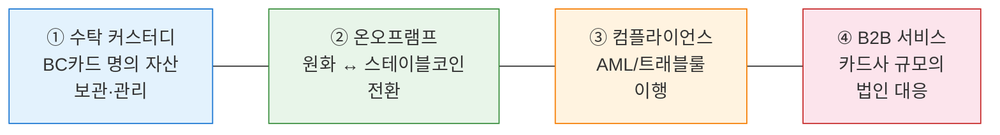

> **[그림]** BC카드 스테이블코인 서비스에 필요한 VASP 4대 역량

이 4가지 역량은 개별적으로 제공되는 것이 아니라, **하나의 통합된 파트너**를 통해 일관성 있게 운영되어야 합니다. 복수의 사업자를 조합할 경우, 커스터디와 온오프램프 간 자산 이동에 추가적인 온체인 트랜잭션이 발생하고, 컴플라이언스 책임 소재가 불명확해지며, 운영 복잡성이 크게 증가합니다.

### 시장 내 파트너 유형별 비교 분석

BC카드는 본 서비스를 위해 다양한 유형의 사업자를 검토하고 있습니다. 각 유형별 장단점을 분석하면 다음과 같습니다.

#### 유형 A: 글로벌 MPC/지갑 기술사

MPC 지갑 기술을 전문으로 제공하는 글로벌 기술 기업으로, 지갑 인프라와 키 관리 솔루션에 강점이 있습니다.

| 항목 | 평가 |
|------|------|
| MPC 지갑 기술 | 우수 (핵심 역량) |
| 한국 VASP 라이선스 | **미보유** — 국내 법적 운영 불가 |
| 커스터디 서비스 | 기술 제공만 가능, 직접 수탁 불가 |
| 온오프램프 | **미제공** — 원화 전환 불가 |
| 한국 규제 대응 | 특금법·트래블룰 직접 이행 불가 |

**한계**: 지갑 기술만 제공하며, 자산 수탁·원화 전환·컴플라이언스 이행을 위해서는 별도의 국내 VASP를 추가로 확보해야 합니다. 파트너가 2개 이상으로 늘어나면 운영 복잡성과 책임 분산 리스크가 증가합니다.

#### 유형 B: 국내 가상자산 거래소

국내 VASP 신고를 완료한 대형 가상자산 거래소입니다. 높은 유동성과 기존 고객 기반을 보유하고 있습니다.

| 항목 | 평가 |
|------|------|
| 한국 VASP 라이선스 | 보유 |
| 커스터디 서비스 | 자체 자산 보관용 (B2C 중심) |
| 온오프램프 | **사업 모델 상 부적합** — 하단 설명 참조 |
| B2B 서비스 대응 | **미흡** — 리테일 트레이딩 중심 사업 모델 |
| 이해충돌 리스크 | **높음** — 자체 거래소와 BC카드 서비스 간 이해충돌 가능 |

**한계**: 거래소의 본업은 리테일 고객 대상 가상자산의 **매수/매도 중개**이며, 이는 원화-스테이블코인 간 직접 전환(온오프램프)과는 본질적으로 다른 사업 구조입니다. 거래소는 매수·매도 주문을 매칭하여 수수료를 수취하는 중개 모델이므로, BC카드가 필요로 하는 대량·정기적 원화 전환(일정산, 실시간 정산)을 안정적으로 수행하는 온오프램프 사업자 역할에는 구조적으로 부적합합니다.

또한, 향후 **디지털자산기본법** 시행 시 가상자산 업권이 **거래업자(거래소)**·**판매업자**·**중개업자**로 세분화될 것으로 예상됩니다. 이 경우 거래소가 온오프램프 역할을 겸하는 것이 업권 규제상 더욱 어려워질 수 있으며, 거래소가 BC카드의 결제 정산 자산을 보관할 경우 자체 거래소 사업과의 이해충돌 문제도 발생합니다. 독립적인 수탁자로서의 중립성이 부족합니다.

#### 유형 C: 국내 전문 커스터디사

가상자산 수탁을 전문으로 하는 국내 VASP입니다. 은행·기관투자자 대상의 보관 서비스에 특화되어 있습니다.

| 항목 | 평가 |
|------|------|
| 한국 VASP 라이선스 | 보유 |
| 커스터디 서비스 | 우수 (핵심 역량) |
| 온오프램프 | **미제공 또는 제한적** — 원화 전환을 위해 별도 사업자 필요 |
| 컴플라이언스 | 수탁 자산 모니터링 중심 |
| MPC 서명 참여 | 구조에 따라 가능하나, 별도 개발 필요 |

**한계**: 자산 보관에는 강점이 있으나, 온오프램프(원화-스테이블코인 전환) 기능을 직접 제공하지 않습니다. BC카드의 일일 정산 규모를 처리하기 위해서는 별도의 온오프램프 사업자를 추가로 확보해야 하며, 커스터디사와 온오프램프 사업자 간 자산 이동에 따른 추가 비용과 지연이 발생합니다.

#### 유형 D: 해외 온오프램프 전문 사업자

법정화폐와 가상자산 간 전환을 전문으로 제공하는 글로벌 사업자입니다.

| 항목 | 평가 |
|------|------|
| 온오프램프 | 우수 (핵심 역량) |
| 한국 VASP 라이선스 | **미보유** — 원화 온오프램프 직접 운영 불가 |
| 커스터디 서비스 | 미제공 또는 제한적 |
| 한국 원화 지원 | **미지원** — 국내 은행 연계 필요 |
| 규제 대응 | 국내 특금법·트래블룰 직접 이행 불가 |

**한계**: 글로벌 온오프램프 사업자는 원화를 직접 지원하지 않으며, 한국 VASP 라이선스가 없어 국내에서 합법적으로 원화-스테이블코인 전환 서비스를 제공할 수 없습니다. 국내 운영을 위해서는 별도의 국내 VASP와의 협력이 필수적입니다.

### 웨이브릿지의 차별적 적합성

웨이브릿지는 상기 4가지 유형과 달리, **커스터디 + 온오프램프 + 컴플라이언스를 하나의 VASP 라이선스 하에서 통합 제공**하는 국내 유일의 사업자입니다.

| 평가 항목 | 유형 A 글로벌 지갑 기술사 | 유형 B 국내 거래소 | 유형 C 국내 커스터디사 | 유형 D 해외 온오프램프 | **웨이브릿지** |
|----------|:-:|:-:|:-:|:-:|:-:|
| 한국 VASP 라이선스 | — | O | O | — | **O** |
| 수탁 커스터디 | — | △ | O | — | **O** |
| 원화 온오프램프 | — | — | — | — | **O** |
| MPC 컴플라이언스 서명 | O | — | △ | — | **O** |
| 트래블룰·AML 이행 | — | O | △ | — | **O** |
| B2B 서비스 대응 | O | — | O | O | **O** |
| 이해충돌 리스크 | 없음 | **높음** | 없음 | 없음 | **없음** |
| **단일 파트너로 완결** | — | — | — | — | **O** |

> O: 충족 / △: 부분 충족 / —: 미충족

### 웨이브릿지 선택의 핵심 이점

**① 단일 파트너 통합 운영**

커스터디·온오프램프·컴플라이언스가 하나의 사업자 내에서 운영되므로, 사업자 간 자산 이동에 따른 추가 온체인 트랜잭션·가스비·시간 지연이 발생하지 않습니다. 상계도 단일 사업자 내에서 처리되어 운영 효율성이 극대화됩니다.

**② 규제적 명확성**

컴플라이언스 책임이 단일 VASP에 귀속되므로, 규제당국과의 소통 및 트래블룰 이행 체계가 명확합니다. 복수 사업자 구조에서 발생하는 "누가 어떤 의무를 이행하는가"의 모호성이 원천적으로 제거됩니다.

**③ 이해충돌 없는 독립적 수탁자**

웨이브릿지는 리테일 거래소를 운영하지 않으므로, BC카드의 자산 보관 및 전환 과정에서 이해충돌이 발생하지 않습니다. BC카드의 자산에 대한 중립적이고 독립적인 수탁자 역할을 수행합니다.

**④ MPC 컴플라이언스 서명 참여**

BC카드가 직접 구축하는 비수탁 지갑(페이북 월렛)의 MPC 2-of-3 구조에서, WB가 컴플라이언스 전용 샤드(#3)를 보유합니다. 이를 통해 비수탁 지갑에서도 VASP 수준의 AML/트래블룰 검증이 가능한 고유한 구조를 실현합니다.

---

## 1. 사업 개요

### 1.1 사업 목표

본 사업은 BC카드와 웨이브릿지가 공동으로 **스테이블코인 기반 결제 서비스**를 구축하는 것을 목표로 합니다.

글로벌 스테이블코인 시장은 결제·송금 분야에서 빠르게 확장되고 있으며, 국내에서도 디지털자산기본법 제정을 계기로 스테이블코인의 "지급이전" 기능이 법적 기반을 갖추게 됩니다. 이러한 시장 환경에서 양사의 핵심 역량을 결합하면 국내 최초의 대규모 스테이블코인 결제 서비스를 선점할 수 있습니다.

**BC카드의 사업 목표**

- 차세대 결제 인프라 확보를 통한 중장기 경쟁력 강화
- 디지털 자산에 친숙한 MZ세대 고객 유입 및 페이북 플랫폼 활성화
- 자체 비수탁 지갑 기술 역량 확보

**웨이브릿지의 역할**

- VASP 라이선스 기반 규제 준수 인프라 제공
- 수탁 보관, 원화 전환, 컴플라이언스 서비스를 통한 안정적인 백엔드 운영

### 1.2 단기 과제 (2026 Q3~Q4)

| 과제 | 내용 | 담당 |
|------|------|------|
| 페이북 월렛 구축 | MPC 기반 비수탁 지갑의 BC페이북 앱 내 구현 | **BC카드** |
| WB 커스터디 연동 | BC카드 명의 수탁 지갑 생성 및 자산 보관 연동 | WB |
| 온오프램프 연동 | 원화-스테이블코인 전환 및 상계 프로세스 검증 | WB |
| 가맹점 결제 실증 | 소규모 가맹점 그룹 대상 QR 결제 테스트 | BC카드(가맹점) + WB(정산) |

### 1.3 장기 과제 (2027~)

- **AI 에이전트 결제 확장**: AI 에이전트가 사용자를 대신하여 스테이블코인 결제를 자율적으로 수행하는 서비스로 확장합니다.
- **원화 스테이블코인 대응**: 디지털자산기본법 시행 후 원화 스테이블코인이 발행될 경우, 이를 결제 수단으로 통합합니다.
- **APAC 글로벌 확장**: 동남아 시장을 중심으로 크로스보더 스테이블코인 결제 서비스를 확장합니다.

### 1.4 수요 검증: 타겟 고객 및 핵심 사용 시나리오

#### 타겟 고객 정의

| 세그먼트 | 특성 | 규모 (추정) | 핵심 니즈 |
|---------|------|-----------|----------|
| 해외 결제 빈번 사용자 | 해외 직구, 해외 송금, 출장 빈번 | 페이북 회원 중 ~15% | 환전 수수료 절감, 실시간 환율 적용 |
| 크립토 친화 MZ세대 | 가상자산 투자 경험, 디지털 결제 선호 | 페이북 회원 중 ~10% | 스테이블코인 보유·활용, 캐시백 |
| 소상공인 가맹점 | 카드 수수료 부담, 정산 주기 개선 희망 | BC카드 가맹점 중 ~5% | 결제 수수료 절감, 즉시 정산 |

#### 사용자 인센티브

- **해외 결제 수수료 절감**: 기존 해외 카드결제 수수료(1.0~2.5%) 대비 스테이블코인 결제 시 환전 마진 최소화
- **24/7 즉시 송금**: 은행 영업시간과 무관하게 스테이블코인 P2P 전송 가능
- **스테이블코인 캐시백**: 결제 시 스테이블코인으로 캐시백 수령 (기존 포인트 대비 글로벌 유동성 보유)
- **자산 다변화**: 원화 외 달러 연동 스테이블코인 보유를 통한 환위험 분산

#### 가맹점 인센티브

- **결제 수수료 절감**: 기존 카드 결제 수수료(1.5~3.0%) 대비 스테이블코인 결제 수수료 절감 가능성
- **정산 주기 단축**: 기존 D+2~3 → D+1 또는 즉시 정산 옵션
- **해외 고객 접점**: 외국인 관광객의 스테이블코인 결제 수용 → 별도 해외카드 가맹 불필요

#### 킬러 유즈케이스 (초기 집중 시나리오)

| 우선순위 | 시나리오 | 대상 | 기대 효과 |
|---------|---------|------|----------|
| 1 | **해외 직구 결제** | 해외 결제 사용자 | 환전 수수료 절감, 실시간 환율 |
| 2 | **P2P 즉시 송금** | MZ세대 | 은행 이체 대비 24/7 즉시 전송, 해외 송금 확장 |
| 3 | **가맹점 즉시 정산** | 소상공인 | 정산 주기 단축, 수수료 절감 |
| 4 | **크로스보더 송금** | 해외 송금 사용자 | 기존 해외 송금 대비 비용·시간 대폭 절감 |

---

## 2. BC카드의 서비스 방향 및 협력사업 내 역할

### 2.1 BC카드의 포지셔닝

BC카드는 여신전문금융업법(여전법)에 의거한 허가 카드사로서, 국내 결제 인프라의 핵심 참여자입니다. 페이북 앱을 통해 약 1,100만 명의 B2C 사용자 기반을 확보하고 있으며, 전국 가맹점 네트워크를 운영하고 있습니다.

현행 금융규제 체계에서는 금융회사와 가상자산 취급 간의 분리(이하 "금가분리 원칙")가 적용되고 있습니다. 이에 따라 본 사업에서 BC카드는 **고객 접점·가맹점 인프라·비수탁 지갑 기술을 담당**하되, 가상자산의 수탁 보관·원화 전환은 수행하지 않는 구조로 참여합니다.

### 2.2 BC카드가 제공하는 서비스

**비수탁 지갑: 페이북 월렛 (BC카드 직접 구축)**

BC카드는 MPC 기반 비수탁형 디지털 지갑인 "페이북 월렛"을 직접 구축·운영합니다. 사용자는 기존 페이북 앱에서 스테이블코인 충전, 잔액 조회, 결제, 전송, 환전 기능을 이용할 수 있습니다. BC카드는 지갑 인프라 운영 및 키 샤드 #2(고객 인증·정책) 관리를 담당하며, WB는 컴플라이언스 검증을 위한 키 샤드 #3만 보유합니다.

**B2C 고객 접점 및 가맹점 네트워크**

페이북 앱 내에 월렛 서비스를 탑재하여, 기존 1,100만 사용자에게 스테이블코인 결제 기능을 제공합니다. 기존 BC카드 가맹점을 스테이블코인 결제 수용 인프라로 확장하며, 가맹점은 기존 BC카드 정산 체계를 통해 원화로 정산받습니다.

### 2.3 웨이브릿지와의 역할 분담 개요

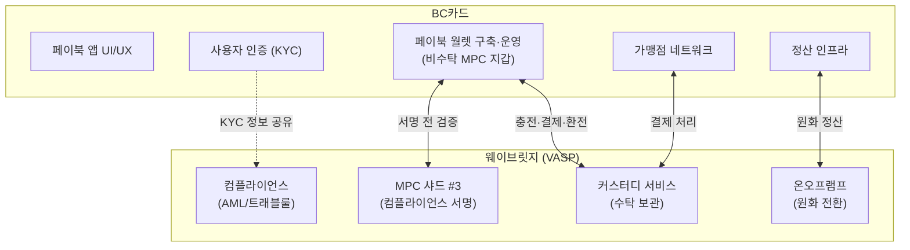

> **[다이어그램 #1]** 양사 역할 분담 구조도

| 영역 | BC카드 | 웨이브릿지 |
|------|--------|-----------|
| 고객 접점 | 페이북 앱 UI/UX, 고객 서비스 | — |
| 비수탁 지갑 | **페이북 월렛 직접 구축·운영**, 키 샤드 #2 보유 | 컴플라이언스 검증용 키 샤드 #3 보유 |
| 사용자 인증 | 기존 KYC 체계 활용 | KYC 정보 수령 (위탁 검증) |
| 자산 보관 | — | 커스터디 서비스 (수탁) |
| 원화 전환 | — | 온오프램프 수행 |
| 가맹점 정산 | 정산망 운영, 원화 지급 | 스테이블코인 → 원화 전환 |
| 컴플라이언스 | — | AML, 트래블룰, 이상거래 탐지 |

### 2.4 자산 소유권·보관 구조 요약

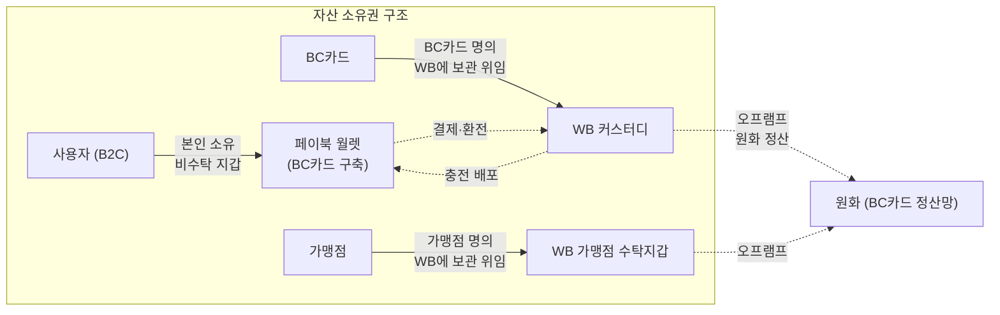

> **[다이어그램 #2]** 자산 소유권 흐름도

---

## 3. 비수탁형 지갑: 페이북 월렛

### 3.1 서비스 개요

| 항목 | 내용 |
|------|------|
| 서비스명 | 페이북 월렛 |
| 대상 | BC페이북 B2C 사용자 (약 1,100만 명) |
| 형태 | BC페이북 앱 내 임베디드 지갑 |
| 지갑 유형 | MPC 기반 비수탁형 (non-custodial) |
| **구축·운영** | **BC카드 직접 구축** |
| 주요 기능 | 스테이블코인 보유, 충전, 결제, 외부 전송, 환전/출금, P2P 송금 |
| 지원 자산 | USDT, USDC (추후 원화 스테이블코인 추가) |

페이북 월렛은 BC카드가 직접 구축하는 MPC 기반 비수탁형 디지털 지갑입니다. 기존 페이북 앱의 간편결제·자산관리·혜택 플랫폼 위에 스테이블코인 기능을 자연스럽게 통합하여, 사용자가 별도의 앱 설치 없이 기존 페이북 경험 내에서 디지털 자산을 활용할 수 있도록 합니다.

### 3.2 페이북 앱과의 통합: 사용자 경험 설계

#### 3.2.1 기존 페이북 앱 기능과의 연계

현재 페이북 앱은 간편결제, 카드 관리, 자산관리, 앱테크(머니박스, 마이태그), 모바일 교통카드, 송금 등 종합 금융 플랫폼으로 운영되고 있습니다. 페이북 월렛은 이러한 기존 기능 체계 위에 스테이블코인 기능을 **네이티브 탭**으로 추가하여, 원화 자산과 디지털 자산을 하나의 앱에서 통합 관리할 수 있도록 설계합니다.

| 기존 페이북 기능 | 페이북 월렛 확장 기능 |
|----------------|---------------------|
| 간편결제 (QR/NFC/온라인) | **스테이블코인 간편결제** — 기존 QR/NFC 결제 인프라를 활용한 스테이블코인 결제 |
| 카드 실적·혜택 관리 | **월렛 거래 내역** — 충전, 결제, 전송, 환전 이력 통합 관리 |
| 자산관리 (마이자산) | **디지털 자산 통합 조회** — 원화 잔액 + 스테이블코인 잔액 + 원화 환산 금액 |
| 송금 | **스테이블코인 P2P 전송** — 페이북 사용자 간 스테이블코인 즉시 전송 |
| 앱테크 (머니박스) | **스테이블코인 적립** — 결제 캐시백을 스테이블코인으로 수령 (향후) |
| 홈 바꾸기 (커스터마이징) | **월렛 위젯** — 홈 화면에 스테이블코인 잔액·환율 위젯 배치 |

#### 3.2.2 페이북 월렛 주요 화면 구성

**① 월렛 홈**

사용자가 페이북 앱 내 "월렛" 탭에 진입하면 보유 스테이블코인 잔액과 원화 환산 금액을 확인할 수 있습니다.

- 보유 자산 총액 (원화 환산)
- 자산별 잔액 (USDT, USDC 등)
- 실시간 환율 정보
- 최근 거래 내역 (충전, 결제, 전송, 환전)
- 빠른 액션 버튼: 충전 / 결제 / 전송 / 환전

**② 충전 (온램프)**

- 충전 금액 입력 (원화 기준)
- 충전할 스테이블코인 선택 (USDT/USDC)
- 실시간 환율 및 예상 수령량 표시
- 결제 수단 선택: BC카드 결제, 계좌이체, 페이북 포인트 전환
- 충전 한도 안내 (1회/1일/1월 한도)

> **온램프 서비스 제공 구조**: 충전 시 원화는 웨이브릿지가 운영하는 BC카드 명의 수탁지갑으로 입금되며, 웨이브릿지가 원화를 스테이블코인으로 전환(온램프)한 후 해당 스테이블코인을 페이북 월렛으로 전송합니다. BC카드는 결제 수단 제공 및 사용자 인증을 담당하고, 온램프 전환 자체는 웨이브릿지의 수탁지갑 서비스의 일부로 수행됩니다. (상세 플로우는 섹션 3.4.2 참조)

**③ 결제**

- **QR 결제**: 가맹점 QR 코드 스캔 → 결제 금액 확인 → 생체 인증 → 결제 완료
- **NFC 결제**: 가맹점 단말기에 디바이스 터치 → 결제 금액 확인 → 결제 완료
- **온라인 결제**: 온라인 결제 시 "페이북 월렛" 결제 수단 선택 → 앱 인증 → 결제 완료
- 결제 시 원화 환산 금액 실시간 표시
- 결제 완료 후 잔액 즉시 갱신

**④ P2P 전송**

- **페이북 사용자 간 전송**: 연락처 또는 페이북 ID로 사용자 검색 → 금액 입력 → 전송 (내부 전송, 수수료 최소)
- **외부 지갑 전송**: 수신 주소 직접 입력 또는 QR 스캔 → AML 검증 → 전송
- **전송 수신**: 외부 지갑으로부터 수신 시 자동 AML 스크리닝 후 잔액 반영

**⑤ 환전/출금 (오프램프)**

- 환전할 스테이블코인 및 금액 선택
- 실시간 환율 및 예상 원화 수령액 표시
- 출금 계좌 선택 (기존 페이북 등록 계좌)
- 환전 수수료 및 예상 소요 시간 안내
- 환전 완료 후 은행 계좌 입금 알림

> **오프램프 서비스 제공 구조**: 환전 시 페이북 월렛의 스테이블코인이 웨이브릿지가 운영하는 BC카드 명의 수탁지갑으로 전송되며, 웨이브릿지가 스테이블코인을 원화로 전환(오프램프)한 후 사용자 계좌로 출금합니다. BC카드는 현금 정산 및 출금 계좌 연동을 담당하고, 오프램프 전환 자체는 웨이브릿지의 수탁지갑 서비스의 일부로 수행됩니다. (상세 플로우는 섹션 3.4.5 참조)

**⑥ 거래 내역 및 리포트**

- 전체 거래 내역: 충전/결제/전송/환전별 필터
- 월별 결제 요약 (기존 카드 사용 내역과 통합 표시)
- 세금 신고용 연간 거래 리포트 다운로드

#### 3.2.3 스테이블코인 적립 기능 (향후)

기존 페이북의 앱테크 기능을 확장하여, 다음과 같은 스테이블코인 적립 기능을 도입할 수 있습니다.

- **결제 캐시백**: 가맹점 결제 시 캐시백을 스테이블코인으로 수령
- **머니박스 연동**: 기존 머니박스(소액 저축) 기능에 스테이블코인 저축 옵션 추가
- **이벤트 리워드**: 페이북 이벤트·프로모션 보상을 스테이블코인으로 지급

이러한 적립 기능은 사용자의 스테이블코인 보유 잔액을 자연스럽게 증가시키고, 결제 사용 빈도를 높이는 선순환 구조를 형성합니다.

### 3.3 MPC 기반 비수탁 구조

#### 3.3.1 MPC(Multi-Party Computation) 지갑 개요

MPC(다자간 연산)란, 하나의 개인키를 여러 조각(키 샤드)으로 분산하여 복수의 주체가 보유하고, 트랜잭션 서명 시 각 주체가 자신의 샤드를 이용해 **부분 서명을 독립적으로 수행**한 후, 이를 결합하여 최종 서명을 완성하는 암호학적 기술입니다.

본 서비스에서는 **2-of-3 임계 서명(Threshold Signature) 구조**를 적용합니다. 3개의 키 샤드 중 2개 이상이 서명에 참여해야 트랜잭션이 성립하며, 어떤 단일 주체도 독자적으로 자산을 이동할 수 없습니다.

| 구분 | 단일 개인키 | MPC 2-of-3 |
|------|-----------|-----------|
| 키 분실 리스크 | 분실 시 자산 영구 손실 | 1개 샤드 분실 시 나머지 2개로 복구 가능 |
| 단일 장애점 | 존재 (키 탈취 시 전액 유출) | 없음 (2개 이상 동시 탈취 필요) |
| 규제 대응 | — | 서명 전 컴플라이언스 검증 가능 |

#### 3.3.2 키 샤드 분배 구조

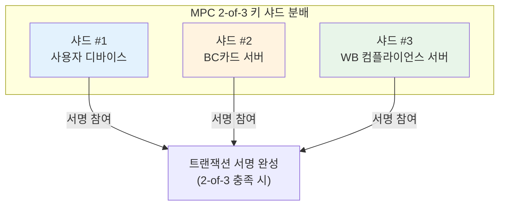

> **[다이어그램 #3]** MPC 키 샤드 분배 구조

| 키 샤드 | 보유 주체 | 역할 | 단독 자산 이동 |
|---------|----------|------|--------------|
| 샤드 #1 | 사용자 디바이스 | 트랜잭션 발의, 사용 의사 표현 | **불가** |
| 샤드 #2 | **BC카드 서버** | 고객 인증 확인, 서비스 정책 적용 | **불가** |
| 샤드 #3 | WB 컴플라이언스 서버 | AML/트래블룰 검증, 컴플라이언스 승인 | **불가** |

#### 3.3.3 비수탁 분류 근거

1. **사용자 키 보유**: 사용자가 키 샤드 #1을 직접 보유하며, 사용자의 서명 없이는 어떤 트랜잭션도 성립하지 않습니다.
2. **BC카드·WB의 독립적 접근 불가**: BC카드(샤드 #2)와 WB(샤드 #3)가 합의하더라도, 사용자(샤드 #1) 없이는 자산 이동이 불가합니다.
3. **사용자 의사 우선**: 모든 트랜잭션은 사용자의 발의(샤드 #1 서명)로부터 시작되며, BC카드와 WB는 이를 검증하는 역할에 한정됩니다.

국제 기준으로는 FATF의 Updated Guidance(2021)에서 "사용자가 독립적으로 트랜잭션을 발의할 수 있고, 서비스 제공자가 사용자 동의 없이 자산을 이동할 수 없는 경우" 비수탁으로 분류하고 있습니다.

#### 3.3.4 비수탁 분류 리스크

**WB의 서명 거부권 문제**: WB는 컴플라이언스 목적으로 샤드 #3의 서명을 거부할 수 있습니다. 이는 AML/CFT 의무 이행에 필수적이나, 규제당국이 이를 "서비스 제공자의 자산 통제권"으로 해석할 경우 수탁으로 판정될 가능성이 있습니다.

**대응 방향**: 서비스 출시 전 FIU 사전 상담을 통해 비수탁 분류의 유효성을 확인하며, 수탁 판정 시를 대비한 대체 구조도 병행 검토합니다. 상세 분석은 섹션 6에서 다룹니다.

### 3.4 페이북 월렛 기능 상세

#### 3.4.1 스테이블코인 보유 및 잔액 조회

| 자산 | 발행사 | 네트워크 | 비고 |
|------|--------|---------|------|
| USDT | Tether | Ethereum / Tron | 글로벌 최대 시가총액 스테이블코인 |
| USDC | Circle | Ethereum / Solana | 규제 친화적, 준비금 투명성 |
| 원화 스테이블코인 | TBD | TBD | 디지털자산기본법 시행 후 추가 |

잔액은 보유 스테이블코인의 수량과 함께, 실시간 환율 기반의 **원화 환산 금액**이 병행 표시됩니다.

#### 3.4.2 충전 (온램프)

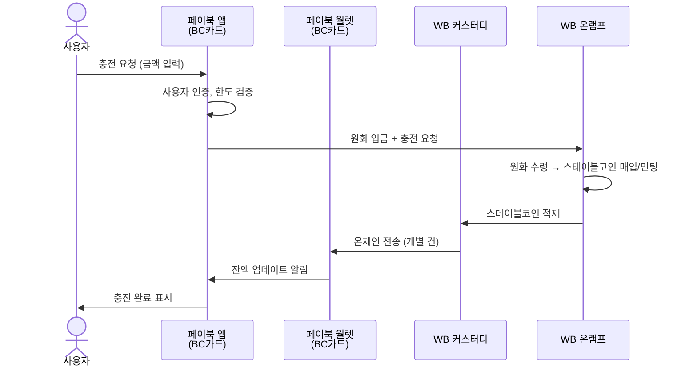

> **[다이어그램 #4]** 충전(온램프) 플로우

#### 3.4.3 결제 (가맹점)

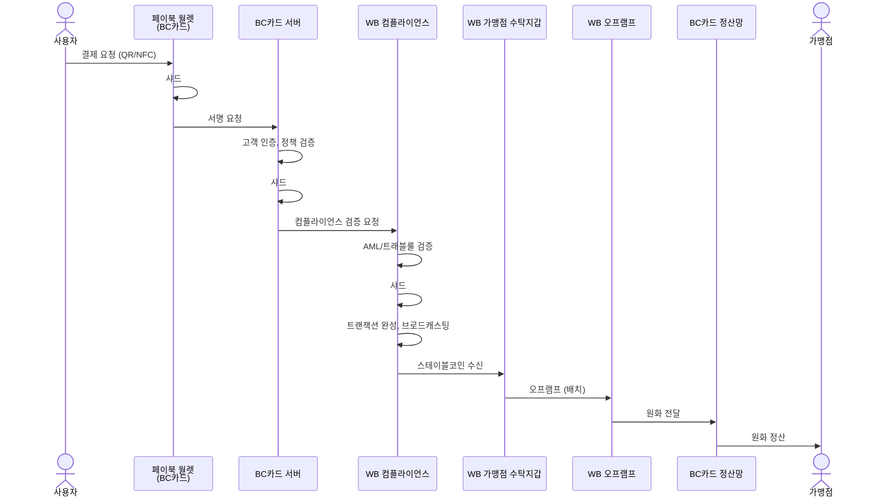

> **[다이어그램 #5]** 결제 플로우

#### 3.4.4 외부 전송 (양방향)

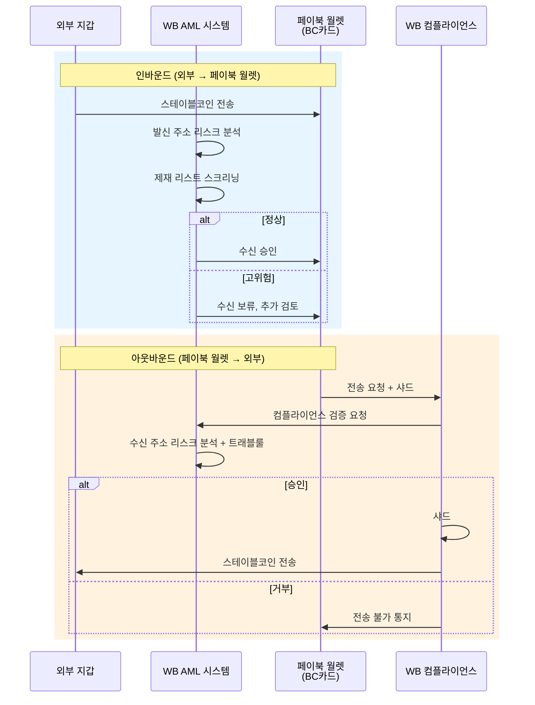

> **[다이어그램 #6]** 외부 전송 플로우

#### 3.4.5 환전/출금 (오프램프)

1. 사용자가 페이북 앱에서 환전/출금 요청
2. 페이북 월렛에서 WB 커스터디로 스테이블코인 전송 (내부 전송)
3. WB 오프램프에서 스테이블코인 → 원화 전환
4. 사용자 지정 은행 계좌로 원화 출금

### 3.5 트랜잭션 서명 프로세스

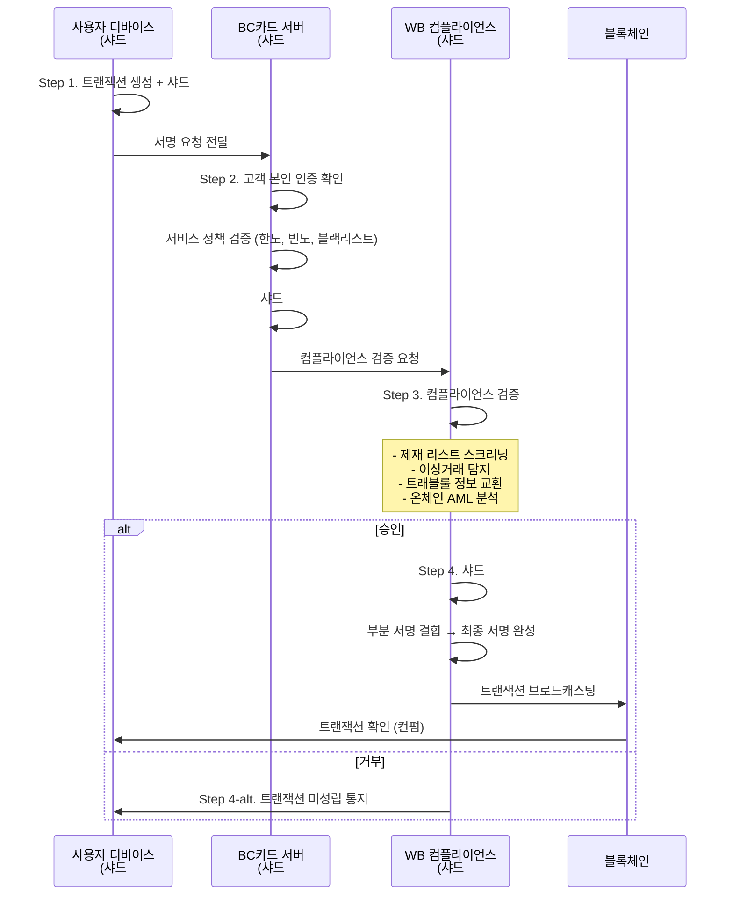

> **[다이어그램 #7]** MPC 트랜잭션 서명 프로세스

### 3.6 가맹점 지갑: 비수탁형 vs 수탁형 비교

#### 3.6.1 옵션 A — 가맹점 비수탁형 (페이북 월렛 가맹점 버전)

**장점**: 가맹점이 스테이블코인을 자율 관리 가능.

**한계**: 원화 정산 시 가맹점이 직접 오프램프를 수행해야 하며, 수신 VASP 부재로 트래블룰 이행이 구조적으로 불가능합니다. 소규모 가맹점의 기술 역량 문제, 정산 자동화 불가 등의 한계가 있습니다.

#### 3.6.2 옵션 B — 가맹점 수탁형 (WB 커스터디)

가맹점이 WB에 온보딩(KYB)하여, WB 수탁지갑으로 결제 대금을 수취하는 구조입니다.

**장점**: WB가 수신 VASP로서 트래블룰 이행, 자동 원화 정산, 가맹점 기술 부담 최소화.

#### 3.6.3 비교 분석 및 결론

| 평가 항목 | 옵션 A: 비수탁형 | 옵션 B: 수탁형 |
|----------|----------------|---------------|
| 원화 정산 자동화 | 불가 | **가능** |
| 트래블룰 준수 | 구조적 불가 | **가능** |
| 가맹점 운영 부담 | 높음 | **낮음** |
| AML/CFT 이행 | 사각지대 발생 | **전 구간 수행** |
| 규제 명확성 | 낮음 | **높음** |
| BC카드 정산 연동 | 개별 대응 필요 | **기존 정산망 활용** |

**결론**: 가맹점 지갑은 **수탁형(옵션 B)**을 권장합니다.

### 3.7 기술적 고려사항

| 항목 | 목표 | 고려사항 |
|------|------|---------|
| MPC 서명 레이턴시 | 3초 이내 | 3자 간 네트워크 통신, 컴플라이언스 검증 시간 포함 |
| 키 복구 | 24시간 이내 | 사용자 디바이스 분실 시, BC카드 본인 인증 + 키 재생성 |
| 앱 임베딩 | 네이티브 수준 UX | BC페이북 앱 내 네이티브 모듈 또는 SDK 연동 |
| 블록체인 네트워크 | 확정 필요 | Ethereum(높은 보안) vs Tron/Solana(낮은 비용, 높은 처리량) |

---

## 4. 웨이브릿지 프라임: 커스터디 및 온오프램프

### 4.1 서비스 개요

| 항목 | 내용 |
|------|------|
| 서비스명 | 웨이브릿지 프라임 (WB Prime) |
| 대상 | BC카드 (B2B 서비스) |
| 서비스 유형 | 수탁 커스터디 + 온오프램프 + 지갑 전송 + 가맹점 정산 + 컴플라이언스 |
| 법적 기반 | 특금법상 VASP 신고 기반 가상자산 보관·관리 서비스 |

> 페이북 월렛(비수탁 지갑)은 BC카드가 직접 구축·운영하며, WB 프라임의 서비스 범위에 포함되지 않습니다.

### 4.2 BC카드 명의 커스터디 서비스

#### 4.2.1 수탁 구조: 기본안과 실시간안

BC카드의 서비스 요구사항에 따라 두 가지 수탁 구조를 선택할 수 있습니다.

**기본안: WB 커스터디 (콜드 월렛 중심)**

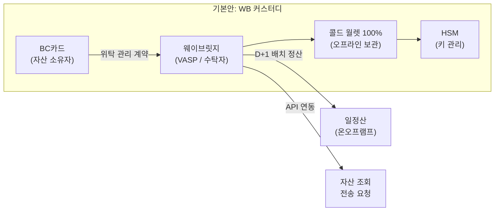

| 항목 | 내용 |
|------|------|
| 보관 방식 | 콜드 월렛 100% (전량 오프라인) |
| 정산 주기 | **D+1 일정산** — 전일 거래 집계 후 익일 온오프램프 일괄 수행 |
| 입출금 | 배치 처리 (출금 요청 후 익일 처리) |
| 서비스 인터페이스 | API 기반 (자산 조회, 전송 요청, 정산 내역 조회) |
| 보안 수준 | 최고 — 온라인 노출 없음 |
| 적합 단계 | **PoC, 서비스 초기** — 보안 우선, 거래량 제한적인 단계 |

**실시간안: WB 프라임 플랫폼**

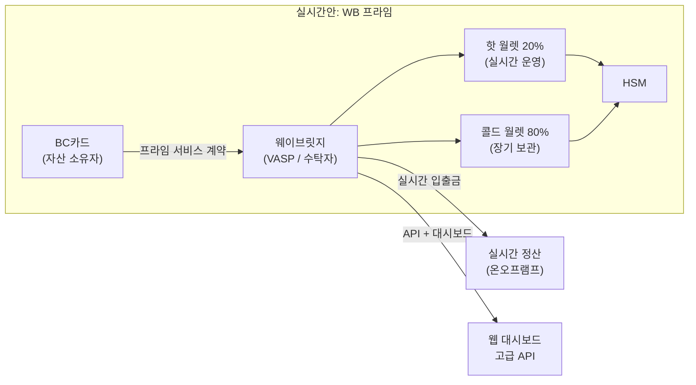

| 항목 | 내용 |
|------|------|
| 보관 방식 | **핫 월렛 20% + 콜드 월렛 80%** |
| 정산 주기 | **실시간** — 건별 또는 시간별 정산 가능 |
| 입출금 | 실시간 처리 (핫 월렛 범위 내 즉시 출금) |
| 서비스 인터페이스 | **API + 웹 대시보드** (실시간 모니터링, 잔액 관리, 리포팅) |
| 보안 수준 | 높음 — 핫 월렛 보험 별도 가입 |
| 적합 단계 | **상용화, 서비스 확장기** — 실시간 결제·정산이 필요한 단계 |

**WB 커스터디 vs WB 프라임 비교**

| 항목 | WB 커스터디 (기본안) | WB 프라임 (실시간안) |
|------|---------------------|---------------------|
| 서비스 성격 | 순수 수탁 보관 | 수탁 보관 + 실시간 운영 플랫폼 |
| 보관 구조 | 콜드 100% | 핫 20% + 콜드 80% |
| 입출금 속도 | D+1 배치 | 실시간 |
| 정산 방식 | 일정산 (배치) | 실시간 / 시간별 / 일정산 선택 |
| 인터페이스 | 기본 API | 고급 API + 웹 대시보드 |
| 수수료 체계 | 수탁 잔액 기반 | 수탁 잔액 + 트랜잭션 기반 |
| **권장 전환 시점** | Phase 2 (PoC) | **Phase 3 (상용화) 이후** |

> **단계별 전환 전략**: Phase 2(PoC) 기간에는 WB 커스터디(기본안)로 안정성을 검증하고, Phase 3(상용화) 진입 시 WB 프라임(실시간안)으로 전환하여 실시간 결제·정산 요구에 대응하는 것을 권장합니다.

#### 4.2.2 보안 아키텍처

| 보안 요소 | 적용 내용 |
|----------|----------|
| 콜드/핫 월렛 분리 | 기본안: 전량 콜드 / 실시간안: 핫 20% + 콜드 80% |
| HSM 적용 | FIPS 140-2 Level 3 이상 |
| 다중 서명 | 출금 시 복수 승인자 다중 서명 필요 |
| 보험 | 해킹·내부 부정 대비 보관 보험 (범위 별도 협의) |

#### 4.2.3 수탁 수수료 구조

**수탁 잔액 기반 연율 과금** 방식. 일일 평균 수탁 잔액에 연율을 적용, 월 단위 정산. 구체 요율은 별도 협의.

### 4.3 온오프램프 서비스

#### 4.3.1 온램프 (원화 → 스테이블코인)

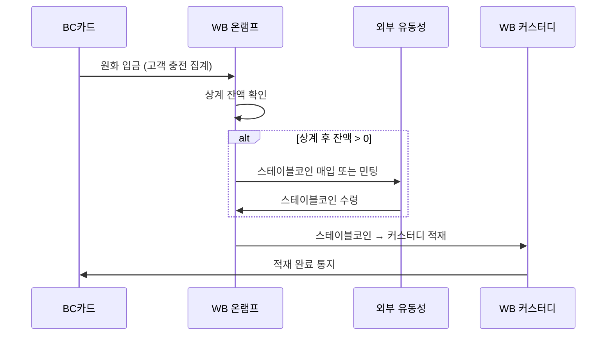

> **[다이어그램 #9]** 온램프 플로우

#### 4.3.2 오프램프 (스테이블코인 → 원화)

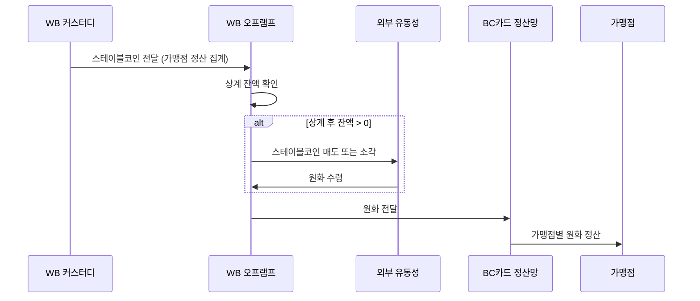

> **[다이어그램 #10]** 오프램프 플로우

#### 4.3.3 상계 구조

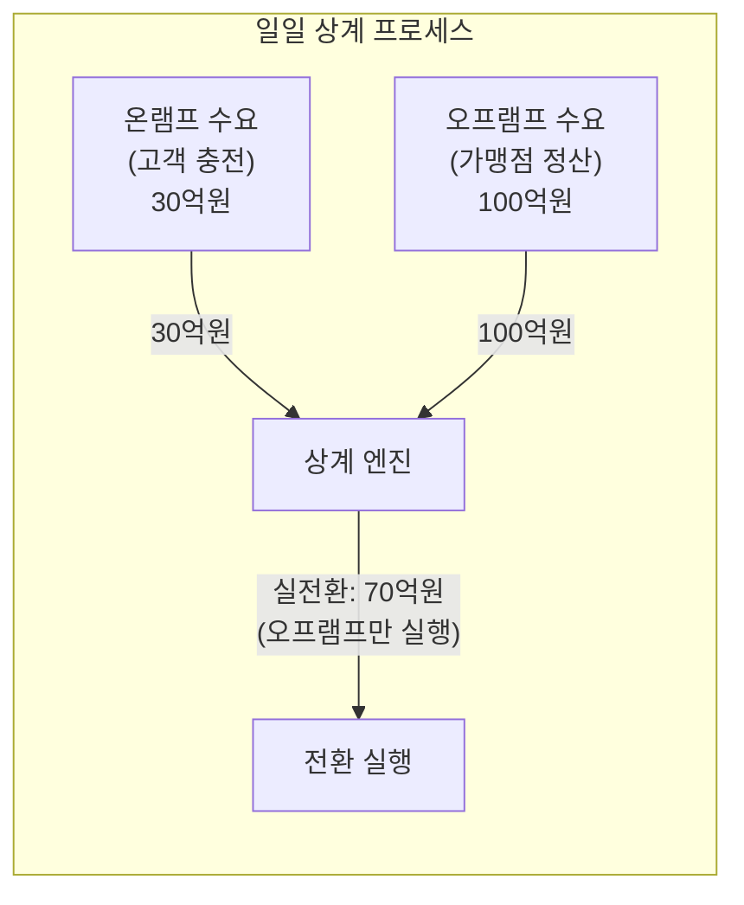

> **[다이어그램 #11]** 상계 구조

| 구분 | 금액 | 설명 |
|------|------|------|
| 오프램프 수요 | 100억원 | 가맹점 결제 대금 원화 정산 |
| 온램프 수요 | 30억원 | 고객 충전 요청 |
| **상계 후 실전환** | **70억원** | 오프램프만 실행 |
| 절감 효과 | 30억원 | 온램프 전환 불필요 (기존 스테이블코인 재활용) |

- 상계 **대상**: 온/오프램프 전환 (원화 ↔ 스테이블코인 교환)
- 상계 **비대상**: 온체인 전송 (WB 커스터디 → 페이북 월렛). 전송은 건별 실제 트랜잭션 필요.

> **상계 효율 변화 전망**: 서비스 초기에는 사용자 충전(온램프) 수요가 가맹점 결제(오프램프) 수요를 상회할 수 있으나, 가맹점 확대에 따라 양방향 거래량의 균형이 형성되면서 상계 비율이 점진적으로 개선됩니다. 성숙기에는 온/오프램프 거래량의 50~70%가 상계 처리되어 실전환 비용이 대폭 절감될 것으로 전망합니다.

#### 4.3.4 전환 수수료 구조

온/오프램프 수수료는 비대칭 설정이 가능합니다 (예: USDC 민팅은 저비용, 소각은 상이). 구체 요율은 별도 협의.

### 4.4 고객 지갑 전송 서비스

#### 4.4.1 인플로우/아웃플로우 비대칭 분석

| 구분 | 아웃플로우 (결제/환전) | 인플로우 (충전 배포) |
|------|---------------------|-------------------|
| 방향 | 페이북 월렛 → WB 커스터디 | WB 커스터디 → 페이북 월렛 |
| 처리 방식 | 배치 집계 → 일괄 전환 | 건별 온체인 전송 |
| 수신 지갑 수 | 소수 (WB 커스터디) | 다수 (개별 사용자 지갑) |
| 가스비 | 상대적 낮음 | **상대적 높음** |
| 운영 공수 | 단순 | **복잡** |

인플로우(충전 배포)는 대량의 개별 사용자 지갑에 각각 온체인 트랜잭션을 발생시켜야 하므로 운영 공수가 큽니다. 이러한 비대칭성이 건별 전송 수수료에 반영됩니다.

### 4.5 가맹점 정산 서비스

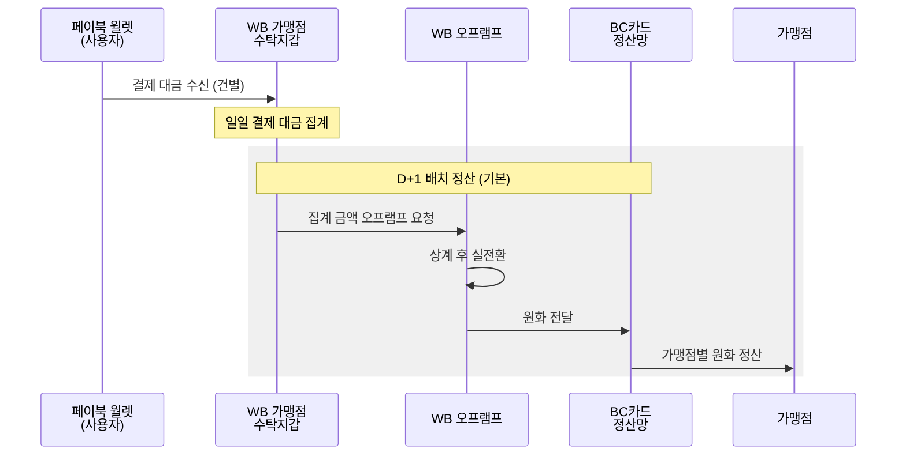

> **[다이어그램 #12]** 가맹점 원화 정산 프로세스

| 정산 옵션 | 주기 | 적합 대상 |
|----------|------|----------|
| D+1 배치 정산 (기본) | 전일 결제 대금을 익일 일괄 정산 | 대부분의 가맹점 |
| 즉시 정산 (옵션) | 건별 또는 시간별 실시간 정산 | 대형/고빈도 가맹점 |

가맹점 입장에서는 기존 카드 결제와 동일한 원화 정산을 받게 되므로, 스테이블코인 결제 수용에 따른 추가 운영 부담이 사실상 없습니다.

### 4.6 기술적 고려사항

| 항목 | 목표/대응 | 상세 |
|------|----------|------|
| 가스비 최적화 | 배치 처리, L2 활용 | 대량 전송 시 배치 그룹핑, L2 네트워크 검토 |
| 네트워크 혼잡 | 큐잉 + 재시도 | 가스비 자동 조정, 실패 시 재시도 |
| SLA | 가용성 99.9% | 커스터디 가용성, 온오프램프 처리 시간 명시 |
| 장애 대응 | 큐잉 + 수동 처리 | 네트워크 장애 시 트랜잭션 큐잉 |

---

## 5. 페이북 월렛 입출금의 온체인 AML 시스템

### 5.1 AML 적용 구간 분류

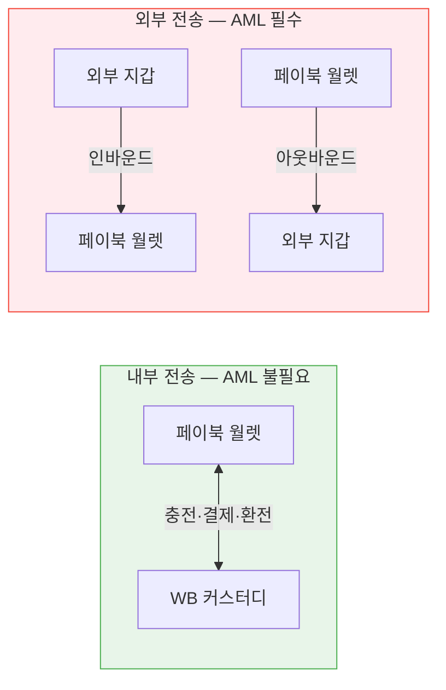

> **[다이어그램 #13]** AML 적용 구간 분류

| 구간 | 발신 | 수신 | AML 적용 | 근거 |
|------|------|------|---------|------|
| 내부 | 페이북 월렛 ↔ WB 커스터디 | 양방향 | 불필요 | 양측 모두 통제된 환경, 사용자 신원 확인 완료 |
| 외부 인바운드 | 외부 지갑 | 페이북 월렛 | **필수** | 자금 출처 불명, 발신자 신원 미확인 |
| 외부 아웃바운드 | 페이북 월렛 | 외부 지갑 | **필수** | 자금 도착지 리스크, 트래블룰 적용 대상 |

### 5.2 인바운드 AML (외부 → 페이북 월렛)

1. **발신 주소 리스크 스코어링**: 온체인 분석 도구를 통해 발신 주소의 거래 이력·연관 주소·리스크 레벨 평가
2. **제재 리스트 스크리닝**: OFAC, UN, EU 등 국제 제재 리스트 대조
3. **자금 출처 온체인 추적 (Hop Analysis)**: 발신 주소로부터 역방향 N-hop 추적, 고위험 출처 여부 분석
4. **판정**: 정상 → 수신 승인 / 고위험 → 수신 보류, 수동 검토

### 5.3 아웃바운드 AML (페이북 월렛 → 외부)

1. **수신 주소 리스크 분석**: 수신 주소의 리스크 스코어 평가
2. **트래블룰 적용**: 수신 VASP 식별 → 정보 교환 / 개인지갑 전송 시 추가 검증
3. **이상거래 탐지**: 소액 다건(structuring), 비정상 패턴, 한도 초과 탐지
4. **MPC 컴플라이언스 게이트**: 상기 검증 통과 시에만 WB가 샤드 #3으로 서명. **미승인 시 트랜잭션 미성립.**

### 5.4 모니터링 인프라 및 서비스 범위

| 서비스 항목 | 서비스 레벨 | 리포팅 |
|------------|-----------|--------|
| 트랜잭션 모니터링 | 실시간 (모든 외부 전송 건) | 일일 요약 리포트 |
| 제재 리스트 스크리닝 | 실시간 | 매칭 건 즉시 통보 |
| 이상거래 탐지 | 실시간 + 배치(패턴 분석) | 주간 분석 리포트 |
| STR 보고 | 탐지 후 24시간 이내 FIU 보고 | 월간 STR 현황 |
| 트래블룰 정보 교환 | 아웃바운드 건별 실시간 | 월간 이행 현황 |

---

## 6. 규제적 쟁점

### 6.1 비수탁 지갑 분류 기준

| 기준 | 비수탁 근거 | 수탁 판정 리스크 |
|------|-----------|----------------|
| FATF Updated Guidance (2021) | 사용자가 키 샤드 보유, 동의 없이 자산 이동 불가 | WB의 서명 거부권이 "통제권"으로 해석 가능 |
| 특금법 | 비수탁 지갑에 대한 명시적 정의 부재 | 해석의 여지 존재 |
| 디지털자산기본법 (입법 예정) | 비수탁 서비스 규제 체계 신설 가능 | 법 시행 전 불확실성 |

**FIU 사전 상담을 통한 유권해석 확보**가 권장됩니다.

**수탁 판정 시 대체 구조 (Plan B)**: 규제당국이 MPC 2-of-3 구조를 수탁으로 판정할 경우, WB가 페이북 월렛의 전체 지갑 인프라를 수탁형으로 전환하여 운영하는 대안 구조를 적용할 수 있습니다. 이 경우 BC카드는 UI/UX 및 가맹점 인프라만 담당하고, 지갑 보관·관리 전체를 WB가 수행하게 됩니다. 사용자 경험에는 실질적 차이가 없으며, 규제 적합성이 명확해지는 대신 BC카드의 자체 지갑 기술 확보 목표는 조정이 필요합니다.

### 6.2 사용자 KYC 구조

| 쟁점 | 현황 | 대응 방향 |
|------|------|----------|
| 제3자 KYC 의존 | BC카드 기존 KYC를 WB가 수용 가능한지 | FATF Rec. 17 정합성 검토 필요 |
| 개인정보 제3자 제공 | BC카드 → WB 사용자 정보 제공 시 동의 필요 | 개인정보보호법 제17조 기반 동의 절차 설계 |
| WB 약관 동의 | 사용자가 WB 이용약관에 동의해야 하는지 | BC페이북 앱 내 동의 흐름 설계 |

BC카드의 기존 KYC 결과를 WB가 수용할 수 있다면, 사용자의 이중 온보딩을 방지하여 서비스 이용 편의성을 크게 높일 수 있습니다.

### 6.3 BC카드의 서비스 범위와 금가분리

- **현행 체계**: BC카드는 지갑 인프라를 구축하되, 가상자산의 수탁 보관·원화 전환은 수행하지 않습니다. 비수탁 지갑은 사용자가 자산의 소유권과 통제권을 직접 보유하므로, BC카드가 가상자산을 취급하는 것으로 보기 어렵습니다.
- **여전법 해석**: 카드사가 비수탁 지갑 인프라를 운영하는 것이 여전법상 부수업무로 인정되는지에 대한 검토가 필요합니다. 비수탁 지갑 운영이 "가상자산 취급"이 아닌 "결제 인프라 서비스"로 분류될 수 있는지, 금융당국의 유권해석 확보가 선행되어야 합니다.
- **디지털자산기본법 시행 후**: 동 법은 2027년 시행이 예상되나, 입법 일정에 불확실성이 존재합니다. 법 시행 전에도 현행 특금법 체계 내에서 서비스 출시가 가능한 구조이나, 법 시행 후 비수탁 지갑 구축자의 법적 지위에 대한 세부 규정 변경 가능성을 고려하여 유연한 구조 설계가 필요합니다.

### 6.4 트래블룰 적용 구조

- **문제**: 페이북 월렛은 비수탁이므로 형식상 발신 측에 VASP가 부재합니다.
- **대응**: WB가 MPC 서명 과정에서 컴플라이언스 게이트를 통해 수신 VASP 식별 및 정보 교환을 사전 수행하여 트래블룰 의무를 이행합니다.

---

## 7. 협업 로드맵 (가안)

### 7.1 단계별 추진 개요

| Phase | 시기 | 목표 |
|-------|------|------|
| **1. 구조 확정** | 2026 4~5월 | 기술·사업 구조 합의, 계약 체결 |
| **2. PoC 개발** | 2026 6~8월 | 핵심 기능 개발 및 통합 테스트 |
| **3. PoC 실증** | 2026 9~10월 | 소규모 실증 운영 |
| **4. 상용화** | 2026 11~12월 | 정식 출시 및 가맹점 확대 |

### 7.2 월별 WBS (가안)

> 아래 일정은 구조 검토를 위한 가안이며, 양사 간 협의를 통해 조정됩니다.

| 월 | BC카드 | 웨이브릿지 | 주요 마일스톤 |
|---|--------|-----------|-------------|
| **4월** | 본 문서 기반 내부 검토·승인 | 기술 아키텍처 상세 설계 문서 제공 | **구조 합의** |
| | NDA 체결 | NDA 체결, DDQ 공유 | |
| | 법률 검토 착수 (금가분리, 여전법) | FIU 사전 상담 준비 | |
| **5월** | MPC 지갑 기술 파트너 선정/평가 | BC카드 명의 커스터디 계정 사전 설정 | **계약 체결** |
| | API 연동 규격 협의 | API 규격서 제공 (커스터디, 온오프램프, AML) | |
| | 서비스 계약 체결 | 서비스 계약 체결 | |
| **6월** | 페이북 월렛 UI/UX 설계 | 커스터디 API 개발 (Sandbox) | **PoC 개발 착수** |
| | MPC SDK 연동 개발 착수 | 온오프램프 Sandbox 환경 구축 | |
| | 테스트넷 환경 구축 | MPC 샤드 #3 서명 모듈 개발 | |
| **7월** | MPC 서명 프로세스 개발 (샤드 #1, #2) | 컴플라이언스 게이트 개발 | **핵심 기능 개발** |
| | BC카드 서버 인증·정책 검증 개발 | AML 스크리닝 연동 (Sandbox) | |
| | 결제 플로우 개발 (QR/NFC) | 트래블룰 정보 교환 모듈 개발 | |
| **8월** | 페이북 앱 월렛 탭 통합 | 커스터디 ↔ 페이북 월렛 전송 통합 테스트 | **통합 테스트** |
| | E2E 통합 테스트 (충전→결제→정산) | 온오프램프 + 상계 엔진 통합 테스트 | |
| | 보안 감사 착수 | 보안 감사 협조 | |
| **9월** | 소규모 가맹점 모집 (10~20개소) | 가맹점 KYB 온보딩 | **PoC 실증 시작** |
| | 내부 임직원 대상 베타 테스트 | 메인넷 환경 구축 및 전환 | |
| | FIU 사전 상담 결과 반영 | 운영 모니터링 체계 가동 | |
| **10월** | PoC 가맹점 실증 운영 | PoC 운영 지원 (커스터디, 정산) | **PoC 결과 평가** |
| | 사용자 피드백 수집·반영 | AML 모니터링 운영 | |
| | PoC 결과 보고서 작성 | PoC 기술 분석 보고서 제공 | |
| **11월** | 페이북 월렛 정식 출시 준비 | WB 프라임 전환 (실시간안 적용) | **상용화 준비** |
| | 가맹점 네트워크 확대 (100개소+) | 가맹점 일괄 KYB 처리 | |
| | CS 체계 구축 (고객 문의 대응) | 운영 SLA 계약 체결 | |
| **12월** | **페이북 월렛 정식 출시** | 상용 환경 안정화 운영 | **서비스 출시** |
| | 가맹점 확대 캠페인 | 정산 자동화 안정화 | |
| | 2027년 확장 계획 수립 | 원화 스테이블코인 대응 준비 | |

### 7.3 Phase 4: 확장 (2027~)

- AI 에이전트 기반 자율 결제 서비스 확장
- 원화 스테이블코인 출시 시 결제 수단 통합
- APAC 시장 크로스보더 결제 확장 검토

### 7.4 수수료 구조 개요

| 수수료 항목 | 과금 기준 | 예상 요율 (가안) | 비고 |
|------------|----------|----------------|------|
| 오프램프 전환 수수료 | 전환 금액 대비 정률 | 0.3~0.8% | 가맹점 정산, 사용자 환전 시 |
| 온램프 전환 수수료 | 전환 금액 대비 정률 | 0.2~0.5% | 사용자 충전 시 |
| 건별 전송 수수료 | 건당 정액 또는 정률 | 500~2,000원/건 | WB 커스터디 → 페이북 월렛 전송 시 |
| 수탁 수수료 | 수탁 잔액 기반 연율 | 0.1~0.3%/년 | 커스터디 자산 보관 |

> 상기 요율은 구조 검토를 위한 가안이며, 양사 간 별도 협의를 통해 확정합니다. Phase 1 종료 시점까지 합의를 목표로 합니다.

---

## 8. 결론: 지금 시작해야 하는 이유

### 왜 지금인가 — 시장과 규제의 교차점

글로벌 결제 시장에서 스테이블코인은 이미 실험 단계를 넘어 상용화 단계에 진입하고 있습니다. Visa는 2024년부터 USDC 기반 정산을 도입했고, Stripe는 스테이블코인 결제 인프라 기업을 인수하며 본격적으로 스테이블코인 결제 시장에 진출하고 있습니다. 글로벌 카드 네트워크가 스테이블코인 정산 체계를 구축하는 지금, 국내 카드사가 준비하지 않으면 차세대 결제 인프라 경쟁에서 뒤처질 수밖에 없습니다.

국내에서도 **디지털자산기본법**이 2027년 시행을 목표로 입법이 진행되고 있으며, 동법 시행 시 스테이블코인의 "지급이전" 기능이 법적 기반을 갖추게 됩니다. 또한 한국은행과 금융당국의 **원화 스테이블코인** 발행 논의도 본격화되고 있습니다. 법 시행 이전에 기술 인프라와 규제 적합성을 사전 검증해야 법 시행과 동시에 서비스를 출시할 수 있는 선점 효과를 확보할 수 있습니다.

### 왜 스테이블코인 결제인가 — 결제 인프라의 구조적 전환

현재 BC페이북이 운영하는 **페이북머니(선불전자지급수단, e-money)**는 전금법 체계 하에서 원화 기반으로 운영되고 있습니다. 그러나 디지털자산기본법 시행 이후, **원화 스테이블코인이 발행되면 기존 선불전자지급수단의 상당 부분이 스테이블코인 기반으로 전환될 것으로 전망**됩니다.

스테이블코인은 기존 e-money 대비 다음과 같은 구조적 우위를 가집니다.

| 항목 | e-money (페이북머니) | 스테이블코인 |
|------|---------------------|-------------|
| 이전 범위 | 특정 플랫폼 내 | **크로스 플랫폼, 글로벌** |
| 정산 속도 | 영업일 기준 | **24/7 실시간** |
| 프로그래머빌리티 | 제한적 | **스마트 컨트랙트 기반 자동화** |
| 글로벌 호환성 | 없음 | **글로벌 결제 네트워크 연동** |
| AI 에이전트 연동 | 불가 | **프로그래머블 결제 가능** |

이러한 구조적 전환에 대비하여, BC카드가 지금부터 스테이블코인 결제 인프라를 구축하는 것은 선택이 아니라 **중장기 경쟁력 확보를 위한 필수 과제**입니다.

### 왜 웨이브릿지인가 — 유일한 통합 파트너

본 문서에서 분석한 바와 같이, BC카드가 필요로 하는 VASP 4대 역량(수탁 커스터디, 원화 온오프램프, 컴플라이언스, B2B 서비스)을 **하나의 VASP 라이선스 하에서 통합 제공**하는 국내 사업자는 웨이브릿지가 유일합니다. 글로벌 기술사, 국내 거래소, 국내 커스터디사, 해외 온오프램프 사업자 중 어느 유형도 단일 파트너로서 BC카드의 요구사항을 완결할 수 없습니다.

웨이브릿지는 리테일 거래소를 운영하지 않는 독립적 VASP로서, BC카드의 자산에 대한 이해충돌 없는 중립적 수탁자 역할을 수행할 수 있습니다. 양사의 협력을 통해 국내 최초의 대규모 스테이블코인 결제 서비스를 선점하고, 향후 원화 스테이블코인 시대에 대비한 차세대 결제 인프라를 확보할 수 있습니다.

---

## 부록

### A. 용어 정의

| 용어 | 정의 |
|------|------|
| MPC | 다자간 연산. 개인키를 복수의 키 샤드로 분산 보관, 부분 서명 결합으로 트랜잭션 완성 |
| 비수탁 (Non-custodial) | 서비스 제공자가 사용자 자산에 대한 독립적 통제권을 보유하지 않는 구조 |
| 수탁 (Custodial) | 서비스 제공자가 사용자를 대신하여 자산을 보관·관리하는 구조 |
| VASP | 가상자산사업자. 특금법에 따라 FIU에 신고한 가상자산 취급 사업자 |
| 트래블룰 | 가상자산 이전 시 송수신인 정보를 함께 전달해야 하는 AML 규정 |
| 온램프 | 법정화폐(원화)를 가상자산(스테이블코인)으로 전환하는 과정 |
| 오프램프 | 가상자산(스테이블코인)을 법정화폐(원화)로 전환하는 과정 |
| 상계 | 매수(온램프)와 매도(오프램프) 수요를 상쇄하여 차액분만 실제 전환하는 구조 |
| HSM | 암호키를 안전하게 보관·관리하는 전용 하드웨어 장치 |
| KYC | 고객 확인 의무. 고객의 신원을 확인하는 절차 |
| KYB | 기업 고객 확인. 법인 고객(가맹점)의 사업자 정보를 확인하는 절차 |
| STR | 의심거래보고. 자금세탁이 의심되는 거래를 FIU에 보고하는 제도 |
| FIU | 금융정보분석원. 자금세탁방지 및 테러자금조달 방지 담당 기관 |
| WB 커스터디 | 웨이브릿지의 콜드 월렛 중심 수탁 보관 서비스 (배치 정산) |
| WB 프라임 | 웨이브릿지의 핫+콜드 복합 운영 플랫폼 (실시간 입출금·정산) |

### B. 참조 법률 및 규제

| 법률/규제 | 관련 내용 |
|----------|----------|
| 특금법 | VASP 신고, AML 의무, 트래블룰 |
| 여전법 | BC카드의 카드업 규제 근거, 부수업무 범위 |
| 전금법 | 전자결제 서비스 규제, 선불전자지급수단 |
| 개인정보보호법 | 제17조: 제3자 제공 동의 |
| 디지털자산기본법 (입법 예정) | 스테이블코인 지급이전, VASP 업권 재정의 (거래업·판매업·중개업 분리) |
| FATF Recommendations | Rec. 15 (가상자산), Rec. 17 (제3자 의존) |

### C. 다이어그램 목록

| 번호 | 제목 | 위치 |
|------|------|------|
| #1 | 양사 역할 분담 구조도 | 섹션 2.3 |
| #2 | 자산 소유권 흐름도 | 섹션 2.4 |
| #3 | MPC 키 샤드 분배 구조 | 섹션 3.3.2 |
| #4 | 충전(온램프) 플로우 | 섹션 3.4.2 |
| #5 | 결제 플로우 | 섹션 3.4.3 |
| #6 | 외부 전송 플로우 | 섹션 3.4.4 |
| #7 | MPC 트랜잭션 서명 프로세스 | 섹션 3.5 |
| #8 | WB 커스터디 수탁 구조 (기본안) | 섹션 4.2.1 |
| #8-2 | WB 프라임 수탁 구조 (실시간안) | 섹션 4.2.1 |
| #9 | 온램프 플로우 | 섹션 4.3.1 |
| #10 | 오프램프 플로우 | 섹션 4.3.2 |
| #11 | 상계 구조 | 섹션 4.3.3 |
| #12 | 가맹점 원화 정산 프로세스 | 섹션 4.5 |
| #13 | AML 적용 구간 분류 | 섹션 5.1 |
